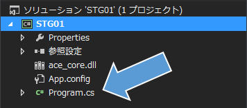

## 01. ウインドウを表示してみよう

### 概要

AmusementCreatorsEngine (以下、ACE) の機能を使用してウインドウを表示してみます。キャラクターを動かす前に画像が表示されるウインドウがないと何もできません。

本章で使用する知識は下記のサイトに記述されていますが、記述されている内容全てをつかうわけではありません！ほんの一部だけです。どこを読めばいいかも記述しています。

* [C# によるプログラミング入門 - コメント](http://ufcpp.net/study/csharp/st_comment.html) 

概要のみ

* [C# によるプログラミング入門 - 反復処理](http://ufcpp.net/study/csharp/st_loop.html) 

if, whileのみ


### ウインドウの表示

プロジェクトの設定を自分でやるのは大変なので、設定済みのプロジェクトをダウンロードして、それを使用します。

[プロジェクト](Projects/STG01.zip)

このファイルを解凍した後、STG.slnというファイルをダブルクリックして開きます。そうすると、VisualStudioが起動します。
起動した後、ソリューションエクスプローラという画面が表示されます。ここには、このプロジェクトに関係するファイルが表示されています。

そこに表示されているファイルの中から、```Program.cs```を選択します。このファイルを編集して、ウインドウを表示します。



とりあえず、ウインドウを表示する前にメニューに表示されている```開始```ボタンを押します。そうすると一瞬ウインドウが表示されて消えました。これでは何が起こっているかわかりません。

```
using System;
using System.Collections.Generic;
using System.Linq;
using System.Text;
using System.Threading.Tasks;

namespace STG
{
	class Program
	{
		static void Main(string[] args)
		{
		}
	}
}

```

```Program.cs ```には、このようなソースコードが記述されています。```開始 ```を押すとMainメソッドが実行されますが、中に何も書いていないのですぐに終了してしまいます。
それでは、何か書いてみましょう。

```
using System;
using System.Collections.Generic;
using System.Linq;
using System.Text;
using System.Threading.Tasks;

namespace STG
{
	class Program
	{
		static void Main(string[] args)
		{
			// Hello World!! という文字を表示します。
			Console.WriteLine("Hello World!!");

			// ユーザーがキーを押すのを待ちます。
			Console.Read();
		}
	}
}

```

ウインドウにHelloWorld!!という文字が表示されて、キーを押すと消えます。
``` Console.WriteLine ``` は文字を表示するメソッド、``` Console.Read(); ``` はユーザーがキーを押すのを待つメソッドです。
```//``` はコメントという機能で、プログラムには影響を与えない説明を記述できるようにする機能です。

ただ、この文字が表示されるウインドウはコンソールウインドウと呼ばれており、基本的に文字しか表示できません。画像を表示させるウインドウはACEの機能を使用して表示する必要があります。

ここでウインドウを表示するために、先ほど追加したソースコードをは消して、このソースコードに書き換えましょう！

```
using System;
using System.Collections.Generic;
using System.Linq;
using System.Text;
using System.Threading.Tasks;

namespace STG
{
	class Program
	{
		static void Main(string[] args)
		{
			// ACEの機能を使用するために初期化処理する。
			// ウインドウのタイトルは「STG01」、画面サイズは(640,480)、オプションは初期値とする。
			// 初期化に成功するとウインドウが表示される。
			ace.Engine.Initialize("STG01", 640, 480, new ace.EngineOption());

			// ACEのウインドウが閉じられていないか確認する。
			// 閉じられていなければ {} 内の処理を実行する。
			while (ace.Engine.DoEvents())
			{
				// ACEを更新する。
				// 様々な処理が行われているが、徐々に説明していく。
				ace.Engine.Update();
			}

			// ACEの終了処理をする。
			// ACEを初期化した場合、アプリケーションを終了する際には必ず実行する必要がある。
			ace.Engine.Terminate();
		}
	}
}
```

再度、```開始```ボタンを押します。そうすると、真っ黒なウインドウが表示されました。

コメントに書いてありますが、```ace.Engine.Initialize ```でACEの初期化をしています。
ここでウインドウに表示されるタイトルや画面サイズ、その他のオプションを設定できます。
この初期化はACEを使用する場合、必ず実行しなければいけません。
初期化に成功すると、ウインドウが表示されます。

次に、```while (ace.Engine.DoEvents()) ```でウインドウが閉じられていないか確認します。
``` ace.Engine.DoEvents() ``` メソッドはウインドウが閉じられていない場合、正(true)、閉じられた場合、否(false)を返します。
whileはtrueを返され続ける限り、``` {} ``` の中身を何度も実行し、falseを返された場合、実行せずに ``` {} ``` の後に移動します。
ウインドウ右上の☓ボタン等を押すと、falseを返すようになります。

ウインドウが表示されている間は、``` ace.Engine.Update(); ``` を実行しACEを更新します。

whileループを抜けると、その後には何もないのでACEの終了処理を行う必要がありますが、その時に、必ず```ace.Engine.Terminate(); ```を実行しましょう。

whileに関して詳しく知りたい方は概要に記述されているリンクの先を見てください。


### Escを押すとウインドウが閉じるようにしてみる

このままでは、ただウインドウが表示されるだけで何もできません。そこで、Escを押したらウインドウが閉じるようにしてみましょう。

Mainメソッドを以下に示すように書き換えます。

```
static void Main(string[] args)
{
	// ACEを初期化する。
	ace.Engine.Initialize("STG01", 640, 480, new ace.EngineOption());

	// ACEのウインドウが閉じられていないか確認する。
	while (ace.Engine.DoEvents())
	{
		// もし、Escキーが押されていたらwhileループを抜ける。
		if(ace.Engine.Keyboard.GetKeyState(ace.Keys.Escape) == ace.KeyState.Push)
		{
			break;
		}

		// ACEを更新する。
		ace.Engine.Update();
	}

	// ACEの終了処理をする。
	ace.Engine.Terminate();
}

```

以下のソースコードが追加されました。

```
if(ace.Engine.Keyboard.GetKeyState(ace.Keys.Escape) == ace.KeyState.Push)
{
	break;
}
```

``` ace.Engine.Keyboard.GetKeyState(ace.Keys.Escape) ``` は ```Esc``` キーの状態、例えば、「押されている」「押されていない」などを返すメソッドです。
そのキーの状態が ``` ace.KeyState.Push ``` だったら ``` {} ``` の中身を実行します。 ``` {} ``` には ``` break ``` が書いてあります。これはwhileループをその場で抜ける機能です。
whileループを抜けると、終了処理が実行されます。この時にウインドウが開いたままならば、自動的にウインドウを閉じます。

```if``` に関して説明していませんが詳しく知りたい方は概要に記述されているリンクの先を見てください。

### まとめ

本章では、ウインドウの表示方法とキーの状態の取得方法を学びました。次章からは、ウインドウに画像を表示し、表示された画像をキーで操作していきます。

