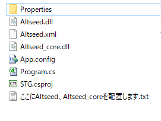
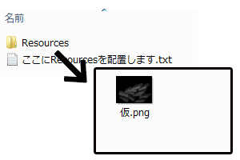

## 02. キャラクターを描画してみよう

### 概要

前章ではウインドウを表示してみました。しかし、画面は真っ黒のままで何も表示されておりません。そこで本章では画面にキャラクターを表示してみます。

本章で使用する知識は下記のサイトに記述されていますが、記述されている内容全てをつかうわけではありません！ほんの一部だけです。どこを読めばいいかも記述しています。

* [C# によるプログラミング入門 - クラス](http://ufcpp.net/study/csharp/oo_class.html) 

この章では自分でクラスを定義はしません。ACEに用意されているクラスを使用するのみです。


### 事前準備

今回も、プロジェクトの設定は自分で変更せずに、設定済みのプロジェクトをダウンロードして、それを使用します。

ただし、注意点があります。本章からは一部のファイルがプロジェクトに含まれておらず、自分で配置する必要があります。
具体的には```ace_cs.dll```、```ace_core.dll```、```ace_cs.xml```といったACEを使用するのに必要なファイルや
画像や音といった見た目に関わるリソースファイルが含まれていません。

ace～のファイルは以下のリンクからダウンロードします。

[DLL](Common/dll.zip)

画像等のファイルは以下のリンクからダウンロードします。

[リソース](Common/Resources.zip)

それらの圧縮ファイルをダウンロードしたら、解凍してプロジェクトに配置します。

[プロジェクト](Projects/STG02.zip)

```dll.zip``` の中身は、```STG02/STG02/``` に配置します。



```Resources.zip```の中身は、```STG02/bin/``` に配置します。この時、```STG02/bin/Resources/画像等``` となるように配置されるようにします。
Windowsの標準機能で解凍した場合、Resourcesのフォルダが2重にできてしまうので注意しましょう。



全てのファイルを配置し終わったら、```STG.sln```を開きます。```Program.cs```には前章で記述したソースコードとほぼソースコードが書いてあります。
今回はこれを変更してキャラクターを表示させます。


### キャラクターの表示

それでは、キャラクターを表示するためにMainメソッドを以下のように書き換えます。


```C#

// ACEを初期化する。
ace.Engine.Initialize("STG02", 640, 480, new ace.EngineOption());

//======== 追加されるソースコード ========//

// シーンを生成する。
ace.Scene scene = new ace.Scene();

// レイヤーを生成する。
ace.Layer2D layer = new ace.Layer2D();

// シーンにレイヤーを追加する。
scene.AddLayer(layer);

// オブジェクトを生成する。
ace.TextureObject2D obj = new ace.TextureObject2D();

// レイヤーにオブジェクトを追加する。
layer.AddObject(obj);

// 画像を読み込み、オブジェクトに設定する。
obj.Texture = ace.Engine.Graphics.CreateTexture2D("Resources/Player.png");

// シーンを切り替える。
ace.Engine.ChangeScene(scene);

//======== ここまで ========//

// ACEのウインドウが閉じられていないか確認する。
while (ace.Engine.DoEvents())
{
	// aceを更新する。
	ace.Engine.Update();
}

// ACEの終了処理をする。
ace.Engine.Terminate();

```

いきなり、シーン、レイヤー、オブジェクト、といった初めて聞く単語がでてきました。
この章は一番に覚えることが多いです。逆にここさえ乗り切れれば後は楽になるでしょう。
クラスという単語が出てきますが、これはアプリケーションを構成するパーツの設計図のようなものです。詳しく知りたい方は概要に記述されているリンクの先を見てください。
この、シーン、レイヤー、オブジェクトはACEに予め用意されたクラスであり、キャラクター1体描画するには冗長な機能ですが、
ある程度ゲームの規模が大きくなると非常に役に立ちます。今回は、将来役に立つと思って乗り切りましょう。

大まかに説明すると、

| 名称 | 内容 |
|:-----------|------------:|
| シーン | タイトル画面、ゲーム画面といった場面を表すパーツ |
| レイヤー | UI(ライフ等の表示)、前景、背景といった場面内で前後方向に分離できるパーツ |
| オブジェクト | キャラクターや敵といったゲーム中を動き回る物体 |

になっています。図で表すと


になります。

本章の場合、タイトル画面やゲーム画面といった場面の区別もなく、UIも背景も表示していないので、シーンもレイヤーも意味をなしていません。
ただ、オブジェクトを描画するためにはシーンとレイヤーが必要なので表示しています。

```C#
// シーンを生成する。
ace.Scene scene = new ace.Scene();
```

ここでシーンを作成しています。newはクラスの情報から実体を生成するC#の機能です。
今回は特にこのシーンにタイトル、ゲーム画面といった役割は割り当てておらず、レイヤーを描画するために存在します。

```C#
// レイヤーを生成する。
ace.Layer2D layer = new ace.Layer2D();

// シーンにレイヤーを追加する。
scene.AddLayer(layer);
```

ここでレイヤーを作成し、シーンに追加します。シーンに追加されたレイヤーの中にあるオブジェクトが描画されます。
シーンと同じく、特にこのレイヤーに役割を割り当てていません。今回は画像を描画するので、```ace.Layer2D``` を使用します。

```C#
// オブジェクトを生成する。
ace.TextureObject2D obj = new ace.TextureObject2D();

// レイヤーにオブジェクトを追加する。
layer.AddObject(obj);

// 画像を読み込み、オブジェクトに設定する。
obj.Texture = ace.Engine.Graphics.CreateTexture2D("Resources/Player.png");
```

ここでオブジェクトを作成し、レイヤーに追加しています。オブジェクトには様々な種類がありますが、
2Dの画像を描画するオブジェクトは、```ace.TextureObject2D```です。このオブジェクトに画像を設定すると、その画像が描画されます。
画像を読み込むには、```ace.Engine.Graphics.CreateTexture2D``` を使用します。読み込まれた画像は、```obj.Texture```に設定されます。

無事動作するとこのように表示されます。

```SS予定 ```

ただ、キャラクターは左上に配置されたままです。今度はこのキャラクターの位置をずらしましょう。

```C#
obj.Position = new ace.Vector2DF(100, 200);
```

というソースコードを追加します。ここでオブジェクトの場所を変更しています。

無事動作するとこのように表示されます。

```SS予定 ```

### まとめ

本章では、画像の表示方法を学びキャラクターを表示しました。次はこのキャラクターを動かしていきます。

