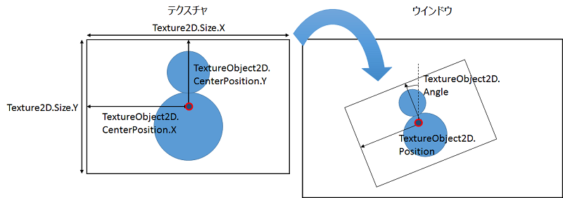

## 03. プレイヤーキャラクターを移動させよう

### 概要

前章ではプレイヤーキャラクターを表示しました。今度は、そのプレイヤーキャラクターをキーボードで移動させてみましょう。

本章では特に新しいC#の知識を必要としていません。


### 事前準備

今回も、自分でプロジェクトの設定せずに、設定済みのプロジェクトをダウンロードして、それを使用します。

[プロジェクト](Projects/STG02.zip)

[DLL](Common/dll.zip)

[リソース](Common/Resources.zip)


### プレイヤーの移動

それでは、プレイヤーを移動させるためにMainメソッドを以下のように書き換えます。

```diff

class Program
{
	[STAThread]
	static void Main(string[] args)
	{
		// ACEを初期化する。
		ace.Engine.Initialize("STG", 640, 480, new ace.EngineOption());

		// プレイヤーオブジェクトを生成する。
		ace.TextureObject2D player = new ace.TextureObject2D();
		
		// エンジンにプレイヤーオブジェクトを追加する。
		ace.Engine.AddObject2D(player);
		
		// 画像を読み込み、プレイヤーオブジェクトに画像を設定する。
		player.Texture = ace.Engine.Graphics.CreateTexture2D("Resources/Player.png");

		// プレイヤーの位置を変更する。
		player.Position = new ace.Vector2DF(320, 240);

		// ACEのウインドウが閉じられていないか確認する。
		while (ace.Engine.DoEvents())
		{
			// もし、Escキーが押されていたらwhileループを抜ける。
			if (ace.Engine.Keyboard.GetKeyState(ace.Keys.Escape) == ace.KeyState.Push)
			{
				break;
			}

+			// もし、上ボタンが押されていたら、位置に(0,-1)を足す。
+			if(ace.Engine.Keyboard.GetKeyState(ace.Keys.Up) == ace.KeyState.Hold)
+			{
+				player.Position = player.Position + new ace.Vector2DF(0, -1);
+			}

			// aceを更新する。
			ace.Engine.Update();
		}

		// ACEの終了処理をする。
		ace.Engine.Terminate();
	}
}

```

プレイヤーを移動させるソースコードを追加しました。

```C#
if(ace.Engine.Keyboard.GetKeyState(ace.Keys.Up) == ace.KeyState.Hold)
```

↑キーが押されているかどうかを取得して、それが押されているかを判断します。もし押されていたらプレイヤーを移動させます。

```C#
player.Position = player.Position + new ace.Vector2DF(0, -1);
```

プレイヤーの位置を、プレイヤーの位置+(0,-1)に変更します。ようは、オプレイヤーを(0,-1)方向に移動します。

このソースコードのままだと上方向にしか進めませんが、↓←→キーも同じようなソースコードを追加することで上下左右に移動できるようになります。
是非、自分で追加してみてください。

無事動作するとこのように表示されます。

```SS予定 ```

### プレイヤーの移動範囲を画面内に制限する

現状のソースコードでは、ずっと同じ方向に移動しているとプレイヤーが画面の外にでてしまいます。
それでは、プレイヤーが画面の外にでないようにしましょう。

それでは、画面の外にでないようにするためにソースコードを追加します。さらにCenterPositionというace.TextureObject2Dの機能も使ってみます。

```diff

class Program
{
	[STAThread]
	static void Main(string[] args)
	{
		// ACEを初期化する。
		ace.Engine.Initialize("STG", 640, 480, new ace.EngineOption());

		// プレイヤーオブジェクトを生成する。
		ace.TextureObject2D player = new ace.TextureObject2D();
		
		// エンジンにプレイヤーオブジェクトを追加する。
		ace.Engine.AddObject2D(player);
		
		// 画像を読み込み、プレイヤーオブジェクトに画像を設定する。
		player.Texture = ace.Engine.Graphics.CreateTexture2D("Resources/Player.png");

+		// プレイヤーの画像の中心を設定する。
+		player.CenterPosition = new ace.Vector2DF(player.Texture.Size.X / 2.0f, player.Texture.Size.Y / 2.0f);

		// プレイヤーの位置を変更する。
		player.Position = new ace.Vector2DF(320, 240);

		// ACEのウインドウが閉じられていないか確認する。
		while (ace.Engine.DoEvents())
		{
			// もし、Escキーが押されていたらwhileループを抜ける。
			if (ace.Engine.Keyboard.GetKeyState(ace.Keys.Escape) == ace.KeyState.Push)
			{
				break;
			}

			// もし、上ボタンが押されていたら、位置に(0,-1)を足す。
			if(ace.Engine.Keyboard.GetKeyState(ace.Keys.Up) == ace.KeyState.Hold)
			{
				player.Position = player.Position + new ace.Vector2DF(0, -1);
			}

			// もし、下ボタンが押されていたら、位置に(0,+1)を足す。
			if (ace.Engine.Keyboard.GetKeyState(ace.Keys.Down) == ace.KeyState.Hold)
			{
				player.Position = player.Position + new ace.Vector2DF(0, +1);
			}

			// もし、左ボタンが押されていたら、位置に(-1,0)を足す。
			if (ace.Engine.Keyboard.GetKeyState(ace.Keys.Left) == ace.KeyState.Hold)
			{
				player.Position = player.Position + new ace.Vector2DF(-1, 0);
			}

			// もし、左ボタンが押されていたら、位置に(+1,0)を足す。
			if (ace.Engine.Keyboard.GetKeyState(ace.Keys.Right) == ace.KeyState.Hold)
			{
				player.Position = player.Position + new ace.Vector2DF(+1, 0);
			}

+			// プレイヤーの位置を取得する。
+			ace.Vector2DF position = player.Position;
+		
+			// プレイヤーの位置を、(テクスチャの大きさ/2)～(ウインドウの大きさ-テクスチャの大きさ/2)の範囲に制限する。
+			position.X = ace.MathHelper.Clamp(position.X, ace.Engine.WindowSize.X - player.Texture.Size.X / 2.0f, player.Texture.Size.X / 2.0f);
+			position.Y = ace.MathHelper.Clamp(position.Y, ace.Engine.WindowSize.Y - player.Texture.Size.Y / 2.0f, player.Texture.Size.Y / 2.0f);
+		
+			// プレイヤーの位置を設定する。
+			player.Position = position;

			// aceを更新する。
			ace.Engine.Update();
		}

		// ACEの終了処理をする。
		ace.Engine.Terminate();
	}
}

class Program
{
	static void Main(string[] args)
	{
		// ACEを初期化する。
		ace.Engine.Initialize("STG", 640, 480, new ace.EngineOption());
		
		// シーンを生成する。
		ace.Scene scene = new ace.Scene();
		
		// レイヤーを生成する。
		ace.Layer2D layer = new ace.Layer2D();
		
		// シーンにレイヤーを追加する。
		scene.AddLayer(layer);
		
		// プレイヤーオブジェクトを生成する。
		ace.TextureObject2D player = new ace.TextureObject2D();
		
		// レイヤーにプレイヤーオブジェクトを追加する。
		layer.AddObject(player);
		
		// 画像を読み込み、プレイヤーオブジェクトに画像を設定する。
		player.Texture = ace.Engine.Graphics.CreateTexture2D("Resources/Player.png");

+		player.CenterPosition = new ace.Vector2DF(player.Texture.X / 2.0f, player.Texture.Y / 2.0f);
			
		// シーンを切り替える。
		ace.Engine.ChangeScene(scene);

		// ACEのウインドウが閉じられていないか確認する。
		while (ace.Engine.DoEvents())
		{
			// もし、Escキーが押されていたらwhileループを抜ける。
			if(ace.Engine.Keyboard.GetKeyState(ace.Keys.Escape) == ace.KeyState.Push)
			{
				break;
			}

			// もし、上ボタンが押されていたら、位置に(0,-1)を足す。
			if(ace.Engine.Keyboard.GetKeyState(ace.Keys.Up) == ace.KeyState.Hold)
			{
				player.Position = player.Position + new ace.Vector2DF(0, -1);
			}

			// もし、下ボタンが押されていたら、位置に(0,+1)を足す。
			if (ace.Engine.Keyboard.GetKeyState(ace.Keys.Down) == ace.KeyState.Hold)
			{
				player.Position = player.Position + new ace.Vector2DF(0, +1);
			}

			// もし、左ボタンが押されていたら、位置に(-1,0)を足す。
			if (ace.Engine.Keyboard.GetKeyState(ace.Keys.Left) == ace.KeyState.Hold)
			{
				player.Position = player.Position + new ace.Vector2DF(-1, 0);
			}

			// もし、左ボタンが押されていたら、位置に(+1,0)を足す。
			if (ace.Engine.Keyboard.GetKeyState(ace.Keys.Right) == ace.KeyState.Hold)
			{
				player.Position = player.Position + new ace.Vector2DF(+1, 0);
			}

+			// プレイヤーの位置を取得する。
+			ace.Vector2DF position = player.Position;
+		
+			// プレイヤーの位置を、(テクスチャの大きさ/2)～(ウインドウの大きさ-テクスチャの大きさ/2)の範囲に制限する。
+			position.X = ace.MathHelper.Clamp(position.X, ace.Engine.WindowSize.X - player.Texture.Size.X / 2.0f, player.Texture.Size.X / 2.0f);
+			position.Y = ace.MathHelper.Clamp(position.Y, ace.Engine.WindowSize.Y - player.Texture.Size.Y / 2.0f, player.Texture.Size.Y / 2.0f);
+		
+			// プレイヤーの位置を設定する。
+			player.Position = position;

				// ACEを更新する。
				ace.Engine.Update();
			}
			
			// ACEの終了処理をする。
			ace.Engine.Terminate();
		}
	}
}

```

CenterPositionをわかりやすく説明するために、ace.TextureObject2Dのパラメーターの関係性を図示しました。
CenterPositionはテクスチャの左上を中心に指定される描画に使用される座標で、CenterPositionの座標がTextureObject2DのPositionに一致するように描画します。
今回は、CenterPositionにテクスチャの大きさの半分の値を指定していますが、そうするとテクスチャの中心がTextureObject2DのPositionの位置になるように描画されます。



ソースコード上では、まず、現在のオブジェクトの位置を取得しています。

そして、その位置を```ace.MathHelper.Clamp ``` というメソッドで一定の範囲の値に収まるようにします。
```ace.MathHelper.Clamp(現在の値,最大値,最小値) ```と指定すると、現在の値が最大値を超えていた場合は最大値、現在の値が最小値を下回っていたら最小値、そうでなかったら現在の値をそのまま返します。
今回の場合は、最大値にはウインドウの大きさ ```ace.Engine.WindowSize.X ``` からオブジェクトに設定されている画像の大きさ ```obj.Texture.Size.X ``` を引いた値を指定しています。
最小値には0を指定しています。これで、画像が画面外にはみ出さないようになります。

最後に変更された座標をプレイヤーキャラクターに設定しています。

無事、画面の外にプレイヤーキャラクターが出なくなったら成功です。

最後に、本章を最後まで終わらせた時のプロジェクトをダウンロードできるようにしておきました。

[プロジェクト](Projects/STG03.zip)

### まとめ

本章では、プレイヤーキャラクターを移動させました。次はこのプレイヤーキャラクターから弾を発射させます。
