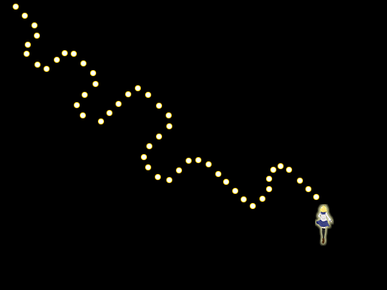
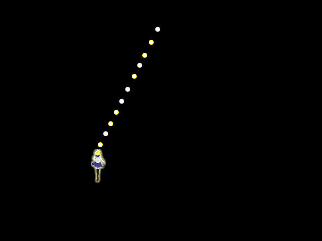

## 04. 弾を撃ってみよう

### 概要

前章ではプレイヤーキャラクターを移動させました。今度は、Zキーを押すとプレイヤーキャラクターが弾を撃つようにしましょう。

本章で使用するC#の知識は下記のWebページに記述されています。記述されている内容のうち一部分のみを使用しますので、どこを読めばいいかも併せて記述しています。

* [C# によるプログラミング入門 - 反復処理](http://ufcpp.net/study/csharp/st_loop.html) 

for

* [C# によるプログラミング入門 - コレクション](http://ufcpp.net/study/csharp/st_loop.html) 

List<T>


### 事前準備

今回も、自分でプロジェクトの設定はせずに、設定済みのプロジェクトをダウンロードして使用します。

[プロジェクト(Windows)](Projects/STG03.zip?raw=true)

[プロジェクト(Mac)](Projects/STG03/Mac.zip?raw=true)

[DLL(Windows)](Common/DLL.zip?raw=true)

[DLL(Mac)](Common/Mac/DLL.zip?raw=true)

[リソース](Common/Resources.zip?raw=true)


### 弾の生成

それでは、Zキーを押したら弾が生成されるように、以下のソースコードを追加します。

```diff

class Program
{
	[STAThread]
	static void Main(string[] args)
	{
		// Altseedを初期化する。
		asd.Engine.Initialize("STG", 640, 480, new asd.EngineOption());

		// プレイヤーのインスタンスを生成する。
		asd.TextureObject2D player = new asd.TextureObject2D();
		
		// 画像を読み込み、プレイヤーのインスタンスに画像を設定する。
		player.Texture = asd.Engine.Graphics.CreateTexture2D("Resources/Player.png");

		// プレイヤーのインスタンスに画像の中心位置を設定する。
		player.CenterPosition = new asd.Vector2DF(player.Texture.Size.X / 2.0f, player.Texture.Size.Y / 2.0f);

		// エンジンにプレイヤーのインスタンスを追加する。
		asd.Engine.AddObject2D(player);

		// プレイヤーのインスタンスの位置を変更する。
		player.Position = new asd.Vector2DF(320, 240);

		// Altseedのウインドウが閉じられていないか確認する。
		while (asd.Engine.DoEvents())
		{
			// もし、Escキーが押されていたらwhileループを抜ける。
			if (asd.Engine.Keyboard.GetKeyState(asd.Keys.Escape) == asd.KeyState.Push)
			{
				break;
			}

			// もし、上ボタンが押されていたら、位置に(0,-1)を足す。
			if(asd.Engine.Keyboard.GetKeyState(asd.Keys.Up) == asd.KeyState.Hold)
			{
				player.Position = player.Position + new asd.Vector2DF(0, -1);
			}

			// もし、下ボタンが押されていたら、位置に(0,+1)を足す。
			if (asd.Engine.Keyboard.GetKeyState(asd.Keys.Down) == asd.KeyState.Hold)
			{
				player.Position = player.Position + new asd.Vector2DF(0, +1);
			}

			// もし、左ボタンが押されていたら、位置に(-1,0)を足す。
			if (asd.Engine.Keyboard.GetKeyState(asd.Keys.Left) == asd.KeyState.Hold)
			{
				player.Position = player.Position + new asd.Vector2DF(-1, 0);
			}

			// もし、右ボタンが押されていたら、位置に(+1,0)を足す。
			if (asd.Engine.Keyboard.GetKeyState(asd.Keys.Right) == asd.KeyState.Hold)
			{
				player.Position = player.Position + new asd.Vector2DF(+1, 0);
			}

+			// もし、Zキーを押したら{}内の処理を行う。
+			if(asd.Engine.Keyboard.GetKeyState(asd.Keys.Z) == asd.KeyState.Push)
+			{
+				// 弾のインスタンスを生成する。
+				asd.TextureObject2D bullet = new asd.TextureObject2D();
+			
+				// 画像を読み込み、弾のインスタンスに画像を設定する。
+				bullet.Texture = asd.Engine.Graphics.CreateTexture2D("Resources/PlayerBullet.png");
+
+				// 弾のインスタンスに画像の中心位置を設定する。
+				bullet.CenterPosition = new asd.Vector2DF(bullet.Texture.Size.X / 2.0f, bullet.Texture.Size.Y / 2.0f);			
+
+				// 弾のインスタンスをエンジンに追加する。
+				asd.Engine.AddObject2D(bullet);
+				
+				// 弾のインスタンスの位置を設定する。
+				bullet.Position = player.Position + new asd.Vector2DF(0, -30);
+				
+			}

			// プレイヤーの位置を取得する。
			asd.Vector2DF position = player.Position;
		
			// プレイヤーの位置を、(テクスチャの大きさ/2)～(ウインドウの大きさ-テクスチャの大きさ/2)の範囲に制限する。
			position.X = asd.MathHelper.Clamp(position.X, asd.Engine.WindowSize.X - player.Texture.Size.X / 2.0f, player.Texture.Size.X / 2.0f);
			position.Y = asd.MathHelper.Clamp(position.Y, asd.Engine.WindowSize.Y - player.Texture.Size.Y / 2.0f, player.Texture.Size.Y / 2.0f);
		
			// プレイヤーの位置を設定する。
			player.Position = position;

			// Altseedを更新する。
			asd.Engine.Update();
		}

		// Altseedの終了処理をする。
		asd.Engine.Terminate();
	}
}

```

もしZキーを押したら、`asd.TextureObject2D ` のインスタンスを新たに生成します。
そして弾の画像を読み込んで、インスタンスに設定し、プレイヤーのインスタンスの前に弾のインスタンスが配置されるように座標を設定しています。

これを実行すると、弾は出現しますが止まっています。



当然ですが、弾を移動させるソースコードを記述していないため、弾は動きません。

弾を動かすために、ListというC#に予め用意されているクラスを使用します。
Listは、任意の他のインスタンスを好きなだけ格納したり、取り出したりできます。
Listの中に、生成された弾のインスタンスを入れて、毎回Altseedを更新するごとに、Listの中にある弾の座標を動かしていきます。

それでは弾を動かせるようにソースコードを追加していきます。

```diff
class Program
{
	[STAThread]
	static void Main(string[] args)
	{
		// Altseedを初期化する。
		asd.Engine.Initialize("STG", 640, 480, new asd.EngineOption());

		// プレイヤーのインスタンスを生成する。
		asd.TextureObject2D player = new asd.TextureObject2D();
		
		// 画像を読み込み、プレイヤーのインスタンスに画像を設定する。
		player.Texture = asd.Engine.Graphics.CreateTexture2D("Resources/Player.png");

		// プレイヤーのインスタンスに画像の中心位置を設定する。
		player.CenterPosition = new asd.Vector2DF(player.Texture.Size.X / 2.0f, player.Texture.Size.Y / 2.0f);

		// エンジンにプレイヤーのインスタンスを追加する。
		asd.Engine.AddObject2D(player);

		// プレイヤーのインスタンスの位置を変更する。
		player.Position = new asd.Vector2DF(320, 240);

+		// リストのインスタンスを生成する。
+		List<asd.TextureObject2D> bullets = new List<asd.TextureObject2D>();

		// Altseedのウインドウが閉じられていないか確認する。
		while (asd.Engine.DoEvents())
		{
			// もし、Escキーが押されていたらwhileループを抜ける。
			if (asd.Engine.Keyboard.GetKeyState(asd.Keys.Escape) == asd.KeyState.Push)
			{
				break;
			}

			// もし、上ボタンが押されていたら、位置に(0,-1)を足す。
			if(asd.Engine.Keyboard.GetKeyState(asd.Keys.Up) == asd.KeyState.Hold)
			{
				player.Position = player.Position + new asd.Vector2DF(0, -1);
			}

			// もし、下ボタンが押されていたら、位置に(0,+1)を足す。
			if (asd.Engine.Keyboard.GetKeyState(asd.Keys.Down) == asd.KeyState.Hold)
			{
				player.Position = player.Position + new asd.Vector2DF(0, +1);
			}

			// もし、左ボタンが押されていたら、位置に(-1,0)を足す。
			if (asd.Engine.Keyboard.GetKeyState(asd.Keys.Left) == asd.KeyState.Hold)
			{
				player.Position = player.Position + new asd.Vector2DF(-1, 0);
			}

			// もし、右ボタンが押されていたら、位置に(+1,0)を足す。
			if (asd.Engine.Keyboard.GetKeyState(asd.Keys.Right) == asd.KeyState.Hold)
			{
				player.Position = player.Position + new asd.Vector2DF(+1, 0);
			}

			// もし、Zキーを押したら{}内の処理を行う。
			if(asd.Engine.Keyboard.GetKeyState(asd.Keys.Z) == asd.KeyState.Push)
			{
				// 弾のインスタンスを生成する。
				asd.TextureObject2D bullet = new asd.TextureObject2D();
			
				// 画像を読み込み、弾のインスタンスに画像を設定する。
				bullet.Texture = asd.Engine.Graphics.CreateTexture2D("Resources/PlayerBullet.png");

				// 弾のインスタンスに画像の中心位置を設定する。
				bullet.CenterPosition = new asd.Vector2DF(bullet.Texture.Size.X / 2.0f, bullet.Texture.Size.Y / 2.0f);			

				// 弾のインスタンスをエンジンに追加する。
				asd.Engine.AddObject2D(bullet);
				
				// 弾のインスタンスの位置を設定する。
				bullet.Position = player.Position + new asd.Vector2DF(0, -30);

+				// 弾のインスタンスをリストに追加する。
+				bullets.Add(bullet);
			}

+			// bulletsに格納されている弾を移動させる
+			for (int i = 0; i < bullets.Count; i++)
+			{
+				// 弾の座標を変更する
+				bullets[i].Position = bullets[i].Position + new asd.Vector2DF(0, -2);
+			}

			// プレイヤーの位置を取得する。
			asd.Vector2DF position = player.Position;
		
			// プレイヤーの位置を、(テクスチャの大きさ/2)～(ウインドウの大きさ-テクスチャの大きさ/2)の範囲に制限する。
			position.X = asd.MathHelper.Clamp(position.X, asd.Engine.WindowSize.X - player.Texture.Size.X / 2.0f, player.Texture.Size.X / 2.0f);
			position.Y = asd.MathHelper.Clamp(position.Y, asd.Engine.WindowSize.Y - player.Texture.Size.Y / 2.0f, player.Texture.Size.Y / 2.0f);
		
			// プレイヤーの位置を設定する。
			player.Position = position;

			// Altseedを更新する。
			asd.Engine.Update();
		}

		// Altseedの終了処理をする。
		asd.Engine.Terminate();
	}
}

```

まず、Listのインスタンスを生成するためのソースコードを追加しましょう。

```C#
List<asd.TextureObject2D> bullets = new List<asd.TextureObject2D>();
```

これでシーンを切り替えた直後にListのインスタンス、`bullets` が生成されました。
Listの隣に`<asd.TextureObject2D>`と書いてありますが、これはasd.TextureObject2Dのインスタンスを格納するListという意味です。

次に、Listのインスタンス `bullets` に弾のインスタンスを追加するソースコードを追加しましょう。

```C#
bullets.Add(bullet);

```

`bullets.Add(bullet);` とすると、bulletsにbulletが格納されます。

最後に、格納されている弾を動かすソースコードを追加しましょう。

```C#
for (int i = 0; i < bullets.Count; i++)
{
	bullets[i].Position = bullets[i].Position + new asd.Vector2DF(0, -2);
}
```

forはwhileを少し複雑にしたような機能です。`for(初期化式; 条件式; 更新式)` というように3つの式を記述できます。
まず、初期化式が実行されます。その後に、条件式を確認し、条件式が返した値がtrueの場合、` {} ` の中身が実行されます。実行された後に更新式が実行されます。
また、条件式を確認し、条件式が返した値がtrueの場合、` {} ` の中身が実行されます。実行された後に・・・と繰り返されます。

今回の場合は、iが0から、bulletsに格納されているオブジェクトの個数を表す`bullets.Count`の値-1まで、変化されつつ{}の中身が実行されます。

`bullets[i] ` はbulletsに格納されているインスタンスの中で、i番目のインスタンスを表しています。ここではi番目のインスタンスの座標を変更しています。

この座標を変更する処理を、0からbullets.Count-1番目のインスタンスに対して実行しています。

このあたりの話は難しいので、色々ソースコードを自分で改造してみて理解することをおすすめします。

forではなくforeachという機能でもこの繰り返しを書くことが可能です。
for・foreachに関して詳しく知りたい方は、概要に記述されているリンクの先を見てください。



無事動作すると、動く弾を出せるようになります。

最後に、本章を最後まで終わらせた時のプロジェクトをダウンロードできるようにしておきました。

[プロジェクト(Windows)](Projects/STG04.zip?raw=true)

[プロジェクト(Mac)](Projects/Mac/STG04.zip?raw=true)

### まとめ

本章では、キャラクターが弾を撃つようになりました。
しかし、ソースコードがどんどん長くなっており、段々わかりにくくなってきています。自分のみが見る場合は問題ありませんが、他人がソースコードを読んだり
しばらく時間をおいた後にソースコードを読んだ時にわかりにくく、困ってしまいます。
そこで次章では、C#の機能を使ってソースコードを整理していきます。

また、現在の弾は画面外に出ても消えずに残っているため、弾を撃ちすぎるとどんどん処理が増え、アプリケーションが重くなってしまいます。
そこで次章では、ソースコードを整理した後に画面外に出た弾を消す処理も加えていきます。
