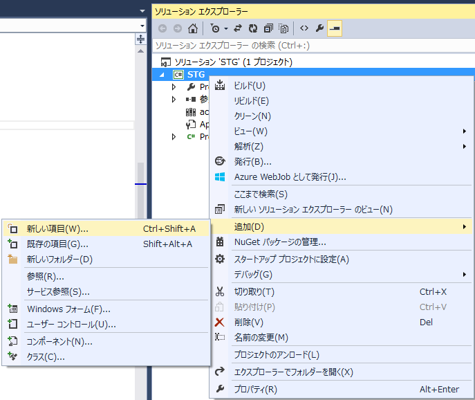
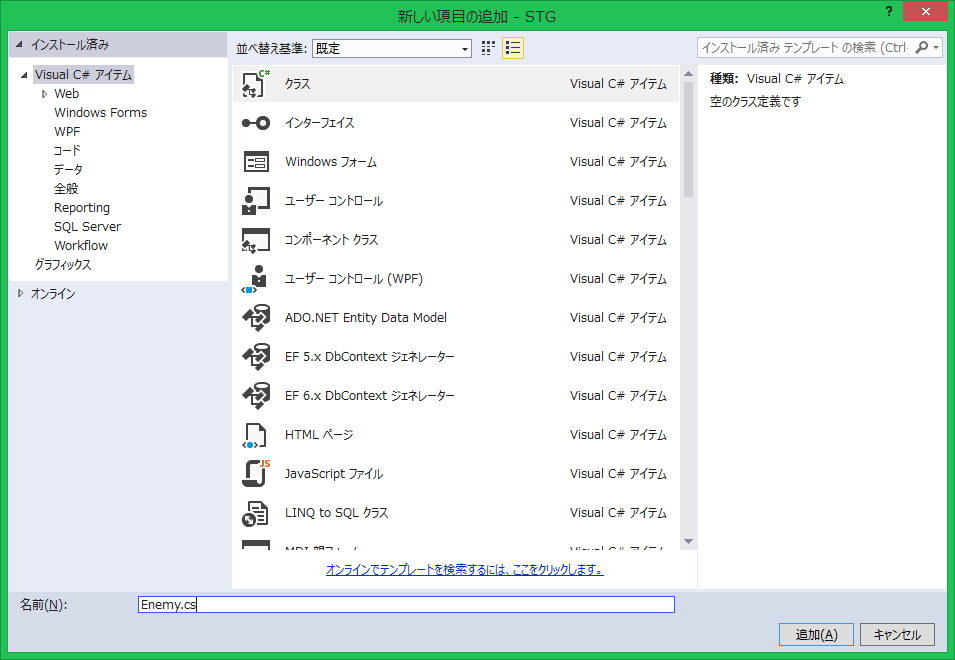
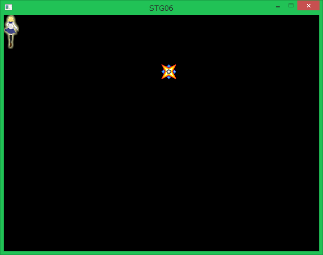
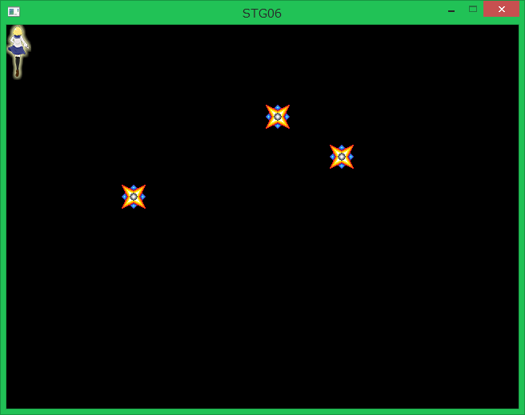

## 06. 敵の表示

### 概要

前回までの内容で、STGにおいて最低の要件を満たす自機を実装したと思います。それではこれに加えてゲームの構成には欠かせない敵キャラクターを作っていきましょう。

### 新しいソースコードの追加

これまでのプログラムを記述していた```Program.cs```は行数が多くなってきたため、見通しが悪くなってきましたね。そこで、新しい.csファイルを追加してソースコードの内容を切り分けましょう。

まずは、以下に示すようにソリューションエクスプローラーの「STG」プロジェクトの上で右クリックして、「追加」→「新しい項目(W)」を選択します。



すると、以下に示す「新しい項目の追加 - STG」の画面が表示されるので、「クラス Visual C# アイテム」を選択した状態で「名前」のところに```Enemy.cs```と打ち込んで右下の「追加(A)」をクリックしてください。すると```Enemy.cs```が実際に作成されて、編集できるようになります。



### 敵クラスの設計と実装

まずは、敵の動きとか特徴を定義するクラス```Enemy```を作成します。先ほど追加した```Enemy.cs```に以下のように書いてください。

```cs
using System;
using System.Collections.Generic;
using System.Linq;
using System.Text;
using System.Threading.Tasks;

namespace STG
{
    public class Enemy : ace.TextureObject2D
    {
        //コンストラクタ(敵の初期位置を引数として受け取る。)
        public Enemy(ace.Vector2DF pos)
            : base()
        {
            //初期位置を設定する。
            Position = pos;

            //敵のテクスチャに使用する画像を読み込んで、設定する。
            Texture = ace.Engine.Graphics.CreateTexture2D("Resources/Enemy.png");
        }
    }
}
```

以前に作成した```Player```クラスと同様の要領でACEのTextureObject2Dクラスを継承することによってEnemyクラスを定義します。```Player```クラスと異なるのはコンストラクタを通じてその位置を設定できることです。
また、敵クラスはそれ専用の画像(Resource/Enemy.png)をテクスチャに使用します。

### 敵の表示
では、この敵をゲーム上で表示できるようにしましょう。オブジェクトをゲーム中に登場させるには以前までに説明したとおり、シーンに登録されたいずれかのレイヤーに追加する必要があります。

前回までに書いた```Program.cs```の```Main```関数を以下のように書き換えることで、```Enemy```クラスのオブジェクトをレイヤーに追加します。

```cs
～省略～

// 自機オブジェクトを生成する。
Player player = new Player();

// レイヤーに自機オブジェクトを追加する。
layer.AddObject(player);

//======== 追加されるソースコード ========//

//敵オブジェクトを生成する。
Enemy enemy = new Enemy(new ace.Vector2DF(320, 100));

//レイヤーに敵オブジェクトを追加する。
layer.AddObject(enemy);

//======== ここまで ========//

// シーンを切り替える。
ace.Engine.ChangeScene(scene);

～省略～
```

自機オブジェクトと同様に、オブジェクトの生成をした後に、レイヤーに追加します。Enemyクラスのコンストラクタには初期位置としてVector2DF構造体を渡すことになっているため、初期位置は(320, 100)としましょう。

このプログラムを実行すると、下の画像に示すように敵キャラクターが表示されるようになります。



### 敵を動かす

現状敵は表示されているだけで、動きもしなければあたってもダメージを受けず弾も撃ってこないただの人畜無害に過ぎません。それでは、敵らしくする第一歩として動きを付けましょう。

動きとしては、決まった方向に向かって移動し続けるというのが一番単純かつ簡単に実装できます。それでは実装してみましょう。Enemy.csを以下のように書き換えてください。

```cs
using System;
using System.Collections.Generic;
using System.Linq;
using System.Text;
using System.Threading.Tasks;

namespace STG
{
    public class Enemy : ace.TextureObject2D
    {
        //速度ベクトル
        private ace.Vector2DF moveVector;

        //コンストラクタ(敵の初期位置を引数として受け取る。)
        public Enemy(ace.Vector2DF pos,ace.Vector2DF movevector)
            : base()
        {
            //現在地を初期位置を設定。
            Position = pos;

            //敵のテクスチャに使用する画像を読み込んで、設定。
            Texture = ace.Engine.Graphics.CreateTexture2D("Resources/Enemy.png");

            //速度ベクトルを設定
            moveVector = movevector;
        }

        protected override void OnUpdate()
        {
            //毎フレーム、速度ベクトル分移動する。
            Position += moveVector;
        }
    }
}
```

コンストラクタには、初期位置に加えて速度ベクトルを渡すようにします。その速度ベクトルを保存しといて、毎フレームその速度ベクトルを位置ベクトル(```Position```)に加算することで、移動し続けます。

それでは、この移動する敵をゲームに登場させるわけですが、コンストラクタに渡す引数が一つ増えたので```Program.cs```の```Main```関数も以下のように変更する必要があります。追加する敵は毎フレームY方向に対して+1.0移動するようにしましょう。

```
～省略～

// 自機オブジェクトを生成する。
Player player = new Player();

// レイヤーに自機オブジェクトを追加する。
layer.AddObject(player);

//======== 追加されるソースコード ========//

//敵オブジェクトを生成する。(速度ベクトル : (0,1))
Enemy enemy = new Enemy(new ace.Vector2DF(320, 100), new ace.Vector2DF(0, 1));
//レイヤーに敵オブジェクトを追加する。
layer.AddObject(enemy);

//======== ここまで ========//

// シーンを切り替える。
ace.Engine.ChangeScene(scene);

～省略～
```

ビルドして実行すると、表示された敵が指定したベクトル(movevector)の方向に移動しているのが分かるとおもいます。


### 敵を複数配置

続いて、敵を一体と言わずに複数配置してみましょう。```Enemy.cs```を以下のように変更してみてください。

```cs
～省略～

// 自機オブジェクトを生成する。
Player player = new Player();

// レイヤーに自機オブジェクトを追加する。
layer.AddObject(player);

//======== 変更されるソースコード ========//

//敵オブジェクト1を生成する。(速度ベクトル : (0,1))
Enemy enemy1 = new Enemy(new ace.Vector2DF(320, 100), new ace.Vector2DF(0, 1));
//レイヤーに敵オブジェクトを追加する。
layer.AddObject(enemy1);

//敵オブジェクト2を生成する。(速度ベクトル : (1,0))
Enemy enemy2 = new Enemy(new ace.Vector2DF(400, 150), new ace.Vector2DF(1, 0));
//レイヤーに敵オブジェクトを追加する。
layer.AddObject(enemy2);

//敵オブジェクト3を生成する。(速度ベクトル : (1,1))
Enemy enemy3 = new Enemy(new ace.Vector2DF(140, 200), new ace.Vector2DF(1, 1));
//レイヤーに敵オブジェクトを追加する。
layer.AddObject(enemy3);

//======== ここまで ========//

// シーンを切り替える。
ace.Engine.ChangeScene(scene);

～省略～
```

先ほどの例に加えて、X方向に+1.0、X,Y方向に+1.0移動する2つの敵を追加しました。
実行結果は以下のようになります。ずいぶんと賑やかに、もといSTGっぽくなりましたね。



### 忘れ物

さて、ここまでに一方向に向かう敵を作成しましたが、この敵の処理でなにか忘れています…

一方向にしか動けない敵の場合、画面外に出たらもうお役御免になりますね。そのお役御免の敵のインスタンスをプログラム上から削除する必要がありますね。オブジェクトが自分自身を削除するには、05章の自機の弾の実装の話より```Vanish()```を呼び出します。

敵についてはその速度ベクトルが任意の値となるため、自機の弾が画面の上にしかはみ出さないのに対して画面外のどこに出るかが想定できません。よって、X,Yの両方向について画面外のはみ出し判定を行う必要があります。それを踏まえて、```Enemy```クラスの```OnUpdate()```メソッドを以下のように変更してください。

```cs
protected override void OnUpdate()
{
	//速度ベクトル分移動する。
	Position += moveVector;

	// 画面外に出たら
	var windowSize = ace.Engine.WindowSize;
	if (Position.Y < -10 || Position.Y > windowSize.Y + 10 || Position.X < -10 || Position.X > windowSize.X + 10)
	{
		// 削除する。
		Vanish();
	}
}
```

画面のサイズはace.Engine.WindowSizeプロパティより取得することが可能です。これに応じて以下の４つの条件のうちどれか一つを満たすと、画面外に出ているとみなすことが出来ます。

* 位置ベクトルのX値が -10 を下回る。
* 位置ベクトルのY値が -10 を下回る。
* 位置ベクトルのX値が (ウィンドウの横方向のサイズ + 10) を上回る。
* 位置ベクトルのY値が (ウィンドウの縦方向のサイズ + 10) を上回る。

以上の条件のいずれかが成立した時に```Vanish()```が呼び出すことにより、画面外に出切った敵オブジェクトはゲーム上から削除されるようになります。

### まとめ

本章では、ゲーム中に動きの付いた敵を表示させる方法について学びました。次章では、敵に弾を撃たせるようにしましょう。

