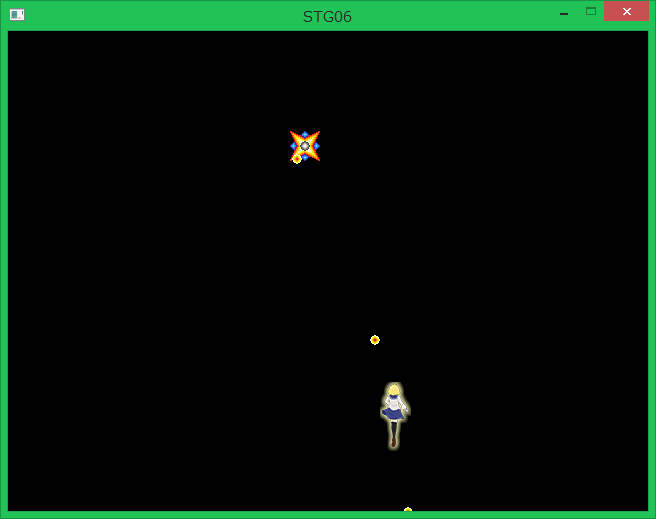
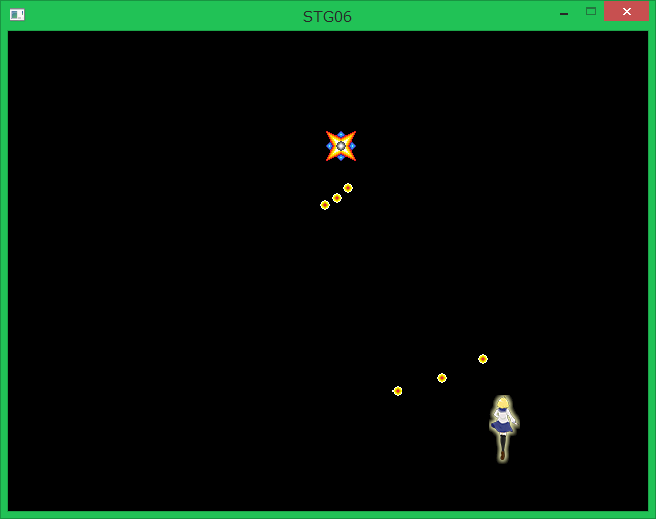
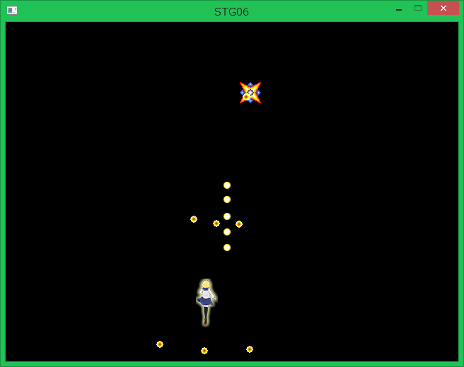

## 07. 敵のショット

### 概要

前回までの内容で、画面上を動く敵を作りました。今回はより敵らしさを増やすべく、弾を撃ってくるようにしましょう。

### 敵の弾クラスの実装

敵の弾は前回に作成した```Enemy```と同様に初期位置と速度ベクトルを与え、初期位置から毎フレーム速度ベクトル分だけ移動する仕様としましょう。
実装の要領と仕様は、それと変わりません。異なるのはテクスチャに使用する画像に"Resource/EnemyBullet.png"を使用することぐらいです。

```cs
using System;
using System.Collections.Generic;
using System.Linq;
using System.Text;
using System.Threading.Tasks;

namespace STG
{
    public class EnemyBullet : ace.TextureObject2D
    {
        //弾の速度ベクトル。
        private ace.Vector2DF moveVelocity;

        //コンストラクタ(敵の初期位置を引数として受け取る。)
        public EnemyBullet(ace.Vector2DF pos, ace.Vector2DF movevelocity)
            : base()
        {
            //現在地を初期位置を設定する。
            Position = pos;

            //弾の速度ベクトルを設定する。
            moveVelocity = movevelocity;

            //弾のテクスチャに使用する画像を読み込んで、設定する。
            Texture = ace.Engine.Graphics.CreateTexture2D("Resources/EnemyBullet.png");
        }

        protected override void OnUpdate()
        {
            //フレーム毎に現在地にmoveVelocityを加算して弾を移動させる。
            Position += moveVelocity;

            // 画面外に出たら
            var windowSize = ace.Engine.WindowSize;
            if (Position.Y < -10 || Position.Y > windowSize.Y + 10 || Position.X < -10 || Position.X > windowSize.X + 10)
            {
                // 削除する。
                Vanish();
            }
        }
    }
}
```

### 敵に弾を撃たせる

では、この弾を実際に発射させてみましょう。具体的には```Enemy```クラスの```OnUpdate()```メソッド内にて発射するタイミングがきた時に、これまでのオブジェクト追加の方法通りで```Layer```に```EnemyBullet```オブジェクトのインスタンスを渡すことで発射処理とすることができます。

弾は60フレームに一回撃たせることとします。この間隔を持った行動パターンを制御するにあたってカウンタを導入します。ここでのカウンタは初期値を0として一回```OnUpdate()```関数が呼び出される度に1増えていくようなものとします。このカウンタによる行動パターンの制御はよく使うテクニックなので憶えておきましょう。
このカウンタ変数を60で割った余りが0になる時に、弾を撃ちます。

今回は基本として、下に向かって弾を撃たせてみましょう。

```diff
using System;
using System.Collections.Generic;
using System.Linq;
using System.Text;
using System.Threading.Tasks;

namespace STG
{
    public class Enemy : ace.TextureObject2D
    {
        //速度ベクトル
        private ace.Vector2DF moveVector;

+        //毎フレーム1増加し続けるカウンタ変数
+        private int count;

        //コンストラクタ(敵の初期位置を引数として受け取る。)
        public Enemy(ace.Vector2DF pos, ace.Vector2DF movevector)
            : base()
        {
            //現在地を初期位置を設定。
            Position = pos;

            //敵のテクスチャに使用する画像を読み込んで、設定。
            Texture = ace.Engine.Graphics.CreateTexture2D("Resources/Enemy.png");

            //速度ベクトルを設定
            moveVector = movevector;

+            //カウンタ変数を0に初期化
+            count = 0;
        }

        protected override void OnUpdate()
        {
            //速度ベクトル分移動する。
            Position += moveVector;

            // 画面外に出たら
            var windowSize = ace.Engine.WindowSize;
            if (Position.Y < -10 || Position.Y > windowSize.Y + 10 || Position.X < -10 || Position.X > windowSize.X + 10)
            {
                // 削除する。
                Vanish();
            }

+           //カウンタ変数が60の倍数の時
+           if (count % 60 == 0)
+           {
+               //弾を発射する
+               Layer.AddObject(new EnemyBullet(Position, new ace.Vector2DF(0, 1)));
+           }

+           ++count;
        }
    }
}
```

実行すると、敵が移動しながら下に向かって弾を撃ってくるようになると思います。

hogehoge

### 自機に向けて弾を飛ばす

さて、速度ベクトルを指定してそのベクトル分移動する弾を実装して、敵が撃ってくるようにしました。しかし弾が下に向かって飛んで行くだけでは味気ないですね。

敵の弾といえば何と言っても自機に向かって撃ってくるものが代表的です。そこで撃った瞬間の自機の場所に向かって弾をとばしてみましょう。

```EnemyBullet```クラスは弾の速度ベクトルを任意のものに設定できるので、一切の変更を加えることなくそれを使いまわすことができます。

敵を自機めがけて撃つには、自機の位置の情報が必要になります。現状、敵オブジェクトが自機の位置の情報へアクセスする手段は存在しないため、その手段を設けます。そのためには、自機オブジェクトに対する参照を敵オブジェクトに持たせることとします。
参照は、敵オブジェクトのコンストラクタを通じて渡すことにしましょう。では、```Enemy.cs```の```Enemy```クラスの一部を以下のように追加・変更します。また、一定の間隔で弾を撃たせるための下準備として1回```OnUpdate()```が呼び出されるごとに1増加するカウンタ変数を導入しましょう。

```cs
～省略～

//キャラクターが現状左に移動している : true, 右に移動している : false。
private bool isGoingLeft;
		
//======== 追加・変更されるソースコード ========//
		
//自機への参照を持つ変数。
private Player playerRef;

//1フレームごとに1増加していくカウンタ変数。
private int count;

//コンストラクタ(敵の初期位置と自機への参照を引数として受け取る。)
public Enemy(ace.Vector2DF pos,Player player)
    : base()
{
    //現在地を初期位置を設定。
    Position = pos;

    //自機への参照を保持。
    playerRef = player;
	
    //カウンタの初期値を0にする。
    count = 0;

//======== ここまで ========//
			
    //敵のテクスチャに使用する画像を読み込んで、設定。
    Texture = ace.Engine.Graphics.CreateTexture2D("Resources/Enemy.png");

～省略～
```

このように```Enemy```クラスのコンストラクタを改造したので、```Enemy```オブジェクトの生成でコンストラクタを呼び出すときの引数に```Player```クラスのインスタンスを表す変数```player```を渡す必要があります。```Program.cs```の```Main```関数の内容を以下のように変更してください。

```cs
～省略～

// レイヤーに自機オブジェクトを追加する。
layer.AddObject(player);

//======== 変更されるソースコード ========//

//敵オブジェクトを生成する。
Enemy enemy = new Enemy(new ace.Vector2DF(320, 100), player);
//レイヤーに敵オブジェクトを追加する。
layer.AddObject(enemy);

//======== ここまで ========//

// シーンを切り替える。
ace.Engine.ChangeScene(scene);

～省略～
```

それでは、この自機への参照を用いて、自機にめがけて一定の間隔で```EnemyBullet```クラスで定義した敵の弾を撃たせてみましょう。```Enemy```クラスの```OnUpdate```メソッドを以下のように変更してください。

```cs
protected override void OnUpdate()
{
	//左に向かって移動する。
	if (isGoingLeft)
	{
		Position -= new ace.Vector2DF(2.0f, 0);

		//位置が移動可能な範囲の左端を超えたとき。
		if (Position.X <= leftLimit.X)
		{
			//右への移動に切り替える。
			isGoingLeft = false;

			//左端を超えないように、補正する。
			Position = new ace.Vector2DF(leftLimit.X, Position.Y);
		}
	}
	else //右に向かって移動する。
	{
		Position += new ace.Vector2DF(2.0f, 0);

		//位置が移動可能な範囲の右端を超えたとき。
		if (Position.X >= rightLimit.X)
		{
			//左への移動に切り替える。
			isGoingLeft = true;

			//右端を超えないように、補正する。
			Position = new ace.Vector2DF(rightLimit.X, Position.Y);
		}
	}

//======== 追加されるソースコード ========//
	
	//カウンタの値が60の倍数の時のみ、弾を撃つ。
	if (count % 60 == 0)
	{
		//自機に向かって弾を撃つ。
		Layer.AddObject(new EnemyBullet(Position, playerRef.Position));
	}
	++count;
	
//======== ここまで ========//

}
```

ソースコードより、カウンタの値が60の倍数の時に弾を撃つようにしています。つまり、敵は60フレームに一回射撃するようになりました。

さて、これまでの内容をビルドすると…　以下のようなエラーが出てきてしまいました。

```
error CS0051: Inconsistent accessibility: parameter type 'STG.Player' is less accessible than method 'STG.Enemy.Enemy(ace.Vector2DF, STG.Player)'
```

エラーの内容をざっと訳すと、「```Player```クラスは```Enemy```クラスのコンストラクタよりもアクセシビリティが少ない」という風になります。```Program.cs```内の```Player```クラスの定義の冒頭を見てみると以下のようになっています。

```
class Player : ace.TextureObject2D
```

ここで、```class```という記述の前には何も書かれていませんが、この状態だとこの```Player```クラスはそれの定義が書かれている.csファイルからのみ参照可能となります。他の.csファイルからも参照できるようにするには、以下のように```class```の前に```public```キーワードを追加します。

```
public class Player : ace.TextureObject2D
```

これでビルドは無事に通り、実行すると以下に示すように一定の間隔で敵が自機めがけて弾を撃ってくるようになると思います。



### もっと弾を撃たせる

シューティングゲームで難易度を上げるのに一番基本的なのは敵の撃つ弾の量を増やすことです。それでは、プレイヤーの周囲めがけて一度に3発の弾を撃つようにしてみましょう。

それでは、```Enemy```クラスの```OnUpdated```メソッドを以下のように変更してください。

```cs
～省略～

//カウンタの値が60の倍数の時のみ、弾を撃つ。
if (count % 60 == 0)
{
	//自機に向かって弾を撃つ。
	Layer.AddObject(new EnemyBullet(Position, playerRef.Position));

//======== 追加されるソースコード ========//

	//敵から見て自機の左方向に10度ずらしたところに向かって弾を撃つ。
	var dir1 = playerRef.Position - Position;
	dir1.Degree -= 10.0f;
	Layer.AddObject(new EnemyBullet(Position, Position + dir1));

	//敵から見て自機の右方向に10度ずらしたところに向かって弾を撃つ。
	var dir2 = playerRef.Position - Position;
	dir2.Degree += 10.0f;
	Layer.AddObject(new EnemyBullet(Position, Position + dir2));
	
//======== ここまで ========//
}

～省略～
```

実行すると、以下のように一定の間隔で敵がプレイヤーの周囲に向かって一度に3発の弾が撃っているのが確認できます。



### 敵弾の初期位置と射撃方向を補正する

さて、現状のプログラムを見ると敵が放つ弾と射撃方向に明らかに違和感があるのがわかると思います。例えば、敵の弾が出てくる箇所が敵の左上だったり、その弾が自機の左上めがけて撃ってるように見えるでしょう。
これは、敵のテクスチャの描画原点が左上になっていることにより、```Enemy```クラスと```Player```クラス内でアクセスしている```Position```変数が表す位置がテクスチャの左上になっていることが原因です。そこで、テクスチャの描画原点をテクスチャの中央とし、```Position```変数が表す位置がテクスチャの中央になるようにしましょう。

以下のように、```Player```クラスと```Enemy```クラスのコンストラクタを変更しましょう。

```cs:Player
public Player()
{
	// 画像を読み込み、オブジェクトに設定する。
	Texture = ace.Engine.Graphics.CreateTexture2D("Resources/Player.png");

//======== 追加されるソースコード ========//
	
	//自機のテクスチャの描画原点を、画像の中心に設定する。(テクスチャサイズが(32,70)なのでその中心は(16,35))
	CenterPosition = new ace.Vector2DF(16, 35);
	
//======== ここまで ========//
}
```

```cs:Enemy
public Enemy(ace.Vector2DF pos,Player player)
	: base()
{
	～省略～

	//最初は左に向かって移動する。
	isGoingLeft = true;
	
//======== 追加されるソースコード ========//

	//敵のテクスチャの描画原点を、画像の中心に設定する。(テクスチャサイズが(30,30)なのでその中心は(15,15))
	CenterPosition = new ace.Vector2DF(15.0f, 15.0f);
	
//======== ここまで ========//
}
```

ついでに、自機が放つ弾の位置も```Player```クラス内の```Position```の値から割り出しているのですが、Positionの指す位置が変わることによって自機テクスチャから見た自機の弾の出処が変わってしまったため、これまで通り自機の右上から弾が出るように再設定しましょう。```Player```クラスの```OnUpdate()```メソッドを以下のように書き換えてください。

```cs:Player.OnUpdate()
protected override void OnUpdate()
{
～省略～
	// もし、Zキーを押したら{}内の処理を行う。
	if (ace.Engine.Keyboard.GetKeyState(ace.Keys.Z) == ace.KeyState.Push)
	{
		// 弾を生成する。
		
//======== 変更されるソースコード ========//

		Bullet bullet = new Bullet(Position + new ace.Vector2DF(Texture.Size.X / 2.0f, -6 - Texture.Size.Y / 2.0f));
		
//======== ここまで ========//

		// 弾をレイヤーに追加する。
		Layer.AddObject(bullet);
	}
}
```

ここまでのプログラムをビルドして実行すると、以下に示すように敵の中心から弾が放たれて、自機の中心とその周辺めがけて弾が撃たれるようになっているのが分かります。



### まとめ

本章では、敵の弾クラスを定義した上で、敵がプレイヤーもしくはその周囲めがけて弾を撃てるようにしました。次回は、オブジェクト指向の重要な要素である継承を学んだ上で、より複雑な敵とその弾の動きを作ってみましょう。

