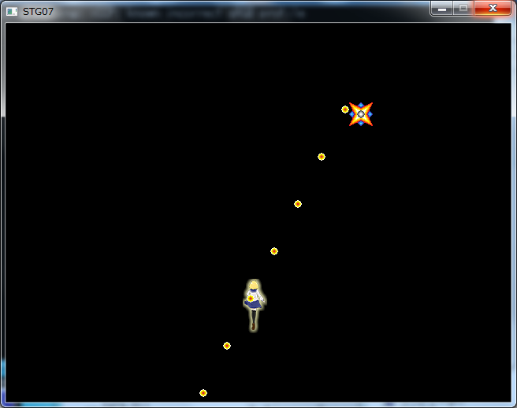
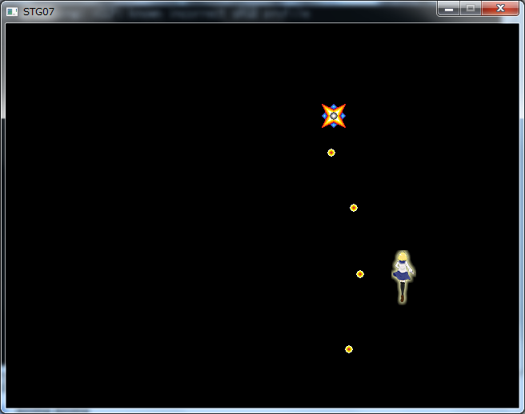
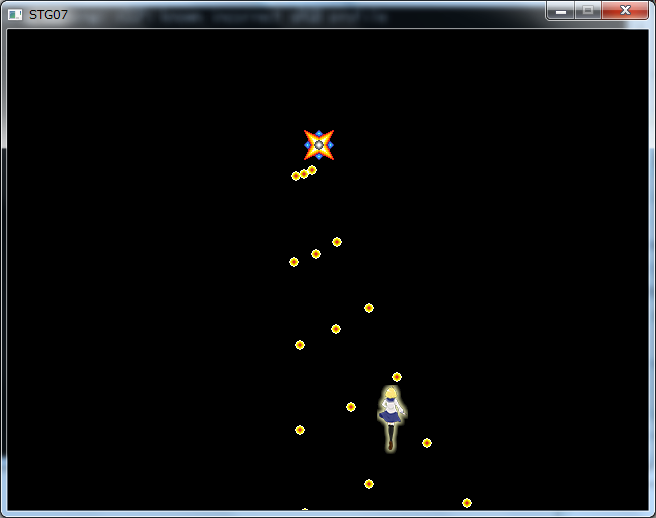
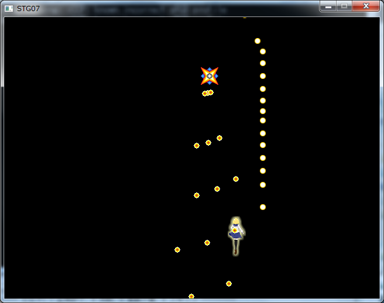

## 07. 敵のショット

### 概要

前回までの内容で、画面上を動く敵を作りました。今回はより敵らしさを増やすべく、弾を撃ってくるようにしましょう。

### 敵の弾クラスの実装

敵の弾は前回に作成した```Enemy```と同様に初期位置と速度ベクトルを与え、初期位置から毎フレーム速度ベクトル分だけ移動する仕様としましょう。
実装の要領と仕様は、それと変わりません。異なるのはテクスチャに使用する画像に"Resource/EnemyBullet.png"を使用することぐらいです。

```cs
using System;
using System.Collections.Generic;
using System.Linq;
using System.Text;
using System.Threading.Tasks;

namespace STG
{
    public class EnemyBullet : ace.TextureObject2D
    {
        //弾の速度ベクトル。
        private ace.Vector2DF moveVelocity;

        //コンストラクタ(敵の初期位置を引数として受け取る。)
        public EnemyBullet(ace.Vector2DF pos, ace.Vector2DF movevelocity)
            : base()
        {
            //現在地を初期位置を設定する。
            Position = pos;

            //弾の速度ベクトルを設定する。
            moveVelocity = movevelocity;

            //弾のテクスチャに使用する画像を読み込んで、設定する。
            Texture = ace.Engine.Graphics.CreateTexture2D("Resources/EnemyBullet.png");
        }

        protected override void OnUpdate()
        {
            //フレーム毎に現在地にmoveVelocityを加算して弾を移動させる。
            Position += moveVelocity;

            // 画面外に出たら
            var windowSize = ace.Engine.WindowSize;
            if (Position.Y < -10 || Position.Y > windowSize.Y + 10 || Position.X < -10 || Position.X > windowSize.X + 10)
            {
                // 削除する。
                Vanish();
            }
        }
    }
}
```

### 敵に弾を撃たせる

では、この弾を実際に発射させてみましょう。具体的には```Enemy```クラスの```OnUpdate()```メソッド内にて発射するタイミングがきた時に、これまでのオブジェクト追加の方法通りで```Layer```に```EnemyBullet```オブジェクトのインスタンスを渡すことで発射処理とすることができます。

弾は60フレームに一回撃たせることとします。この間隔を持った行動パターンを制御するにあたってカウンタを導入します。ここでのカウンタは初期値を0として一回```OnUpdate()```関数が呼び出される度に1増えていくようなものとします。このカウンタによる行動パターンの制御はよく使うテクニックなので憶えておきましょう。
このカウンタ変数を60で割った余りが0になる時に、弾を撃ちます。弾の方向としては下に向かって毎フレーム3.0移動するようなものにしてみます。

それではこれまでに述べた仕様を反映させます。```Enemy.cs```を以下のように変更して下さい。

```diff
using System;
using System.Collections.Generic;
using System.Linq;
using System.Text;
using System.Threading.Tasks;

namespace STG
{
    public class Enemy : ace.TextureObject2D
    {
        //速度ベクトル
        private ace.Vector2DF moveVector;

+        //毎フレーム1増加し続けるカウンタ変数
+        private int count;

        //コンストラクタ(敵の初期位置を引数として受け取る。)
        public Enemy(ace.Vector2DF pos, ace.Vector2DF movevector)
            : base()
        {
            //現在地を初期位置を設定。
            Position = pos;

            //敵のテクスチャに使用する画像を読み込んで、設定。
            Texture = ace.Engine.Graphics.CreateTexture2D("Resources/Enemy.png");

            //速度ベクトルを設定
            moveVector = movevector;

+           //カウンタ変数を0に初期化
+           count = 0;
        }

        protected override void OnUpdate()
        {
            //速度ベクトル分移動する。
            Position += moveVector;

            // 画面外に出たら
            var windowSize = ace.Engine.WindowSize;
            if (Position.Y < -10 || Position.Y > windowSize.Y + 10 || Position.X < -10 || Position.X > windowSize.X + 10)
            {
                // 削除する。
                Vanish();
            }

+           //カウンタ変数が60の倍数の時
+           if (count % 60 == 0)
+           {
+               //弾を発射する
+               Layer.AddObject(new EnemyBullet(Position, new ace.Vector2DF(0, 3.0)));
+           }

+           ++count;
        }
    }
}
```

その射撃の挙動を見るにあたって、敵の数を減らして挙動を変更します。Program.csの```Main```関数を以下のように変更して下さい。

```diff
～（省略）～

+ //敵オブジェクトを生成する。(速度ベクトル : (0.5,0))
+ Enemy enemy = new Enemy(new ace.Vector2DF(10, 100), new ace.Vector2DF(0.5f, 0));
+ //レイヤーに敵オブジェクトを追加する。
+ layer.AddObject(enemy);

- //敵オブジェクト1を生成する。(速度ベクトル : (0,1))
- Enemy enemy1 = new Enemy(new ace.Vector2DF(320, 100), new ace.Vector2DF(0, 1));
- //レイヤーに敵オブジェクトを追加する。
- layer.AddObject(enemy1);

- //敵オブジェクト2を生成する。(速度ベクトル : (1,0))
- Enemy enemy2 = new Enemy(new ace.Vector2DF(400, 150), new ace.Vector2DF(1, 0));
- //レイヤーに敵オブジェクトを追加する。
- layer.AddObject(enemy2);

- //敵オブジェクト3を生成する。(速度ベクトル : (1,1))
- Enemy enemy3 = new Enemy(new ace.Vector2DF(140, 200), new ace.Vector2DF(1, 1));
- //レイヤーに敵オブジェクトを追加する。
- layer.AddObject(enemy3);

～（省略）～
```

実行すると、下に示すように敵が左にゆっくり移動しながら60フレームに一回下に向かって弾を撃ってくるようになると思います。



### 自機に向けて弾を飛ばす

さて、速度ベクトルを指定して毎フレームそのベクトル分移動する弾を実装して、敵がその弾を下に向かって撃ってくるようにしました。しかし下に向かって飛んで行くだけでは味気ないですね。

敵の弾といえば何と言っても自機に向かって撃ってくるものが代表的です。そこで撃った瞬間の自機の場所に向かって弾をとばしてみましょう。

敵を自機めがけて撃つには、自機の位置の情報が必要になります。現状、敵オブジェクトが自機の位置の情報へアクセスする手段は存在しないため、その手段を設けます。そのためには、自機オブジェクトに対する参照を敵オブジェクトに持たせることとします。その参照は、敵オブジェクトのコンストラクタを通じて渡すことにしましょう。

では実装してみます。```Enemy.cs```の```Enemy```クラスのメンバ変数の定義とコンストラクタの一部を以下のように追加・変更します。

```diff
～省略～
        //毎フレーム1増加し続けるカウンタ変数
        private int count;

+       //プレイヤーへの参照
+       private Player player;

        //コンストラクタ(敵の初期位置を引数として受け取る。)
- 		public Enemy(ace.Vector2DF pos, ace.Vector2DF movevector)
+       public Enemy(ace.Vector2DF pos, ace.Vector2DF movevector,Player player)
            : base()
        {
            //現在地を初期位置を設定。
            Position = pos;

            //敵のテクスチャに使用する画像を読み込んで、設定。
            Texture = ace.Engine.Graphics.CreateTexture2D("Resources/Enemy.png");

            //速度ベクトルを設定
            moveVector = movevector;

            //カウンタ変数を0に初期化
            count = 0;

+           //Playerクラスへの参照を保持
+           this.player = player;
        }
～省略～
```

続いて、```Enemy```クラスの```OnUpdate()```メソッドの射撃処理を、自機めがけて撃つように変更します。ちなみに、前節で作った```EnemyBullet```クラスは弾の速度ベクトルを任意のものに設定できるので、```EnemyBullet```クラスには一切の変更を加えることなくそれを使いまわすことができます。

```diff
～省略～
            //カウンタ変数が60の倍数の時
            if (count % 60 == 0)
            {
+               //自分の位置から自機の位置へ対するベクトルを計算。
+               ace.Vector2DF dir = player.Position - Position;

+               //ベクトルの長さを1.5に変更。
+               ace.Vector2DF moveVelocity = dir.Normal * 1.5f;

                //弾を発射する
-				Layer.AddObject(new EnemyBullet(Position, new ace.Vector(0,1)));
+               Layer.AddObject(new EnemyBullet(Position, moveVelocity));
            }
～省略～
```

最後に、```Enemy```クラスのコンストラクタを改造したので、```Enemy```オブジェクトの生成でコンストラクタを呼び出すときの引数に```Player```クラスのインスタンスを表す変数```player```を渡す必要があります。```Program.cs```の```Main```関数の内容を以下のように変更してください。

```diff
～（省略）～

  //敵オブジェクトを生成する。(速度ベクトル : (0.5,0))
+ Enemy enemy = new Enemy(new ace.Vector2DF(10, 100), new ace.Vector2DF(0.5f, 0),player);
- Enemy enemy = new Enemy(new ace.Vector2DF(10, 100), new ace.Vector2DF(0.5f, 0));
  //レイヤーに敵オブジェクトを追加する。
  layer.AddObject(enemy);

～（省略）～
```

さて、これまでの内容をビルドすると…　以下のようなエラーが出てきてしまいました。

```
error CS0051: Inconsistent accessibility: parameter type 'STG.Player' is less accessible than method 'STG.Enemy.Enemy(ace.Vector2DF, STG.Player)'
```

エラーの内容をざっと訳すと、「```Player```クラスは```Enemy```クラスのコンストラクタよりもアクセシビリティが少ない」という風になります。```Program.cs```内の```Player```クラスの定義の冒頭を見てみると以下のようになっています。

```
class Player : ace.TextureObject2D
```

ここで、```class```という記述の前には何も書かれていませんが、この状態だとこの```Player```クラスはそれの定義が書かれている.csファイルからのみ参照可能となります。他の.csファイルからも参照できるようにするには、以下のように```class```の前に```public```キーワードを追加します。

```
public class Player : ace.TextureObject2D
```

これでビルドは無事に通り、実行すると以下に示すように一定の間隔で敵が自機めがけて弾を撃ってくるようになると思います。



### もっと弾を撃たせる

シューティングゲームで難易度を上げるのに一番基本的なのは敵の撃つ弾の量を増やすことです。それでは、プレイヤーの周囲めがけて一度に3発の弾を撃つようにしてみましょう。

それでは、```Enemy```クラスの```OnUpdated```メソッドを以下のように変更してください。

```diff
～省略～
            //カウンタ変数が60の倍数の時
            if (count % 60 == 0)
            {
				//自分の位置から自機の位置へ対するベクトルを計算。
				ace.Vector2DF dir = player.Position - Position;

				//ベクトルの長さを1.5に変更。
				ace.Vector2DF moveVelocity = dir.Normal * 1.5f;

                //弾を発射する。
				Layer.AddObject(new EnemyBullet(Position, moveVelocity));
				
+				//moveVelocityを時計方向に10.0度回転させたベクトルmoveVelocity2を作成。
+				ace.Vector2DF moveVelocity2 = moveVelocity;
+				moveVelocity2.Degree += 10.0f;

				//moveVelocity2を速度ベクトルとして弾を発射する。
+				Layer.AddObject(new EnemyBullet(Position, moveVelocity2));

				//moveVelocityを反時計方向に10.0度回転させたベクトルmoveVelocity3を作成。
+				ace.Vector2DF moveVelocity3 = moveVelocity;
+				moveVelocity3.Degree -= 10.0f;

				//moveVelocity3を速度ベクトルとして弾を発射する。
+				Layer.AddObject(new EnemyBullet(Position, moveVelocity3));
            }
～省略～
```

実行すると、以下のように一定の間隔で敵がプレイヤーの周囲に向かって一度に3発の弾が撃っているのが確認できます。



### 敵弾の初期位置と射撃方向を補正する

さて、現状のプログラムを見ると敵が放つ弾と射撃方向に明らかに違和感があるのがわかると思います。例えば、敵の弾が出てくる箇所が敵の左上だったり、その弾が自機の左上めがけて撃ってるように見えるでしょう。
これは、敵のテクスチャの描画原点が左上になっていることにより、```Enemy```クラス、```Player```クラスならびに```EnemyBullet```クラス内でアクセスしている```Position```変数が表す位置がテクスチャの左上になっていることが原因です。そこで、テクスチャの描画原点をテクスチャの中央とし、```Position```変数が表す位置がテクスチャの中央になるようにしましょう。

以下のように、```Player```クラス、```Enemy```クラスならびに```EnemyBullet```クラスのコンストラクタを変更しましょう。

```diff:Player
public Player()
{
	// 画像を読み込み、オブジェクトに設定する。
	Texture = ace.Engine.Graphics.CreateTexture2D("Resources/Player.png");
	
+	//自機のテクスチャの描画原点を、画像の中心に設定する。
+	CenterPosition = new ace.Vector2DF(Texture.Size.X, Texture.Size.Y);
}
```

```diff:Enemy
public Enemy(ace.Vector2DF pos, ace.Vector2DF movevector,Player player)
	: base()
{
	//現在地を初期位置を設定。
	Position = pos;

	//敵のテクスチャに使用する画像を読み込んで、設定。
	Texture = ace.Engine.Graphics.CreateTexture2D("Resources/Enemy.png");

	//速度ベクトルを設定
	moveVector = movevector;

	//カウンタ変数を0に初期化
	count = 0;

	//Playerクラスへの参照を保持
	this.player = player;
	
+	//敵のテクスチャの描画原点を、画像の中心に設定する。
+	CenterPosition = new ace.Vector2DF(Texture.Size.X / 2.0f, Texture.Size.Y / 2.0f);
}
```

```diff
public EnemyBullet(ace.Vector2DF pos, ace.Vector2DF movevelocity)
	: base()
{
	//現在地を初期位置を設定する。
	Position = pos;

	//弾の速度ベクトルを設定する。
	moveVelocity = movevelocity;

	//弾のテクスチャに使用する画像を読み込んで、設定する。
	Texture = ace.Engine.Graphics.CreateTexture2D("Resources/EnemyBullet.png");

+	//弾のテクスチャの描画原点を、画像の中心に設定する。
+	CenterPosition = new ace.Vector2DF(Texture.Size.X / 2.0f, Texture.Size.Y / 2.0f);
}
```

ついでに、自機が放つ弾の位置も```Player```クラス内の```Position```の値から割り出しているのですが、Positionの指す位置が変わることによって自機テクスチャから見た自機の弾の出処が変わってしまったため、これまで通り自機の右上から弾が出るように再設定しましょう。```Player```クラスの```OnUpdate()```メソッドを以下のように書き換えてください。

```diff:Player.OnUpdate()
protected override void OnUpdate()
{
～省略～
	// もし、Zキーを押したら{}内の処理を行う。
	if (ace.Engine.Keyboard.GetKeyState(ace.Keys.Z) == ace.KeyState.Push)
	{
		// 弾を生成する。
		Bullet bullet = new Bullet(Position + new ace.Vector2DF(Texture.Size.X / 2.0f, -6 - Texture.Size.Y));

		// 弾をレイヤーに追加する。
		Layer.AddObject(bullet);
	}
}
```

ここまでのプログラムをビルドして実行すると、以下に示すように敵の中心から弾が放たれて、自機の中心とその周辺めがけて弾が撃たれるようになっているのが分かります。



### Vanishの判定をテクスチャサイズを用いて行う

最後に、画面外に出た時に消去する判定でPositionに対して適用しているパディングが10という雑な数値になっているのを、テクスチャのサイズを用いて適切なパディングを設定しましょう。```Enemy```クラス並びに```EnemyBullet```クラス内に記述されている画面外に出た時の処理を以下のように変更して下さい。

```diff
+           // 画面外に出たら
+           var windowSize = ace.Engine.WindowSize;
+           if (Position.Y < -Texture.Size.Y || Position.Y > windowSize.Y + Texture.Size.Y || Position.X < -Texture.Size.X || Position.X > windowSize.X + Texture.Size.X)
+           {
+               // 削除する。
+               Vanish();
+           }

-           // 画面外に出たら
-           var windowSize = ace.Engine.WindowSize;
-           if (Position.Y < -10 || Position.Y > windowSize.Y + 10 || Position.X < -10 || Position.X > windowSize.X + 10)
-           {
-               // 削除する。
-               Vanish();
-           }
```

### まとめ

本章では、敵の弾クラスを定義した上で、敵がプレイヤーもしくはその周囲めがけて弾を撃てるようにしました。次回は、オブジェクト指向の重要な要素である継承を学んだ上で、より複雑な敵とその弾の動きを作ってみましょう。