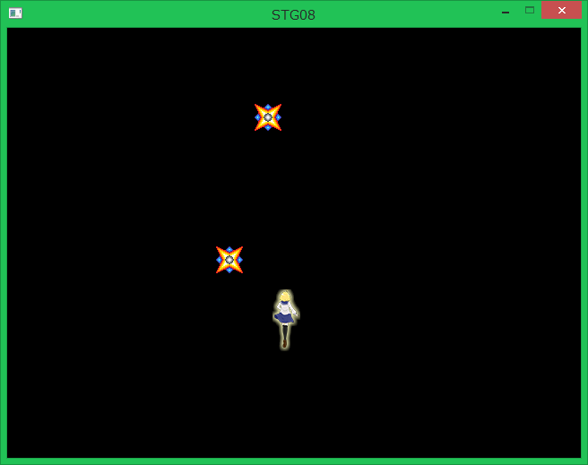
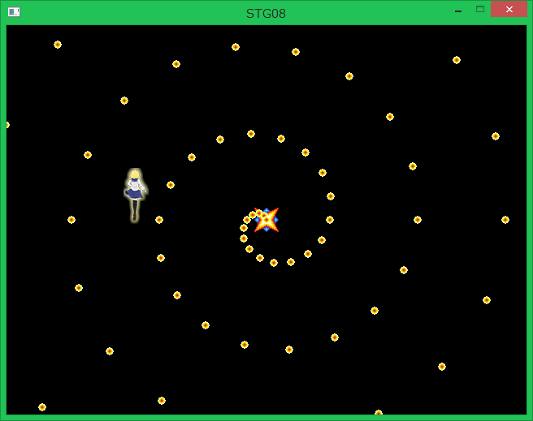
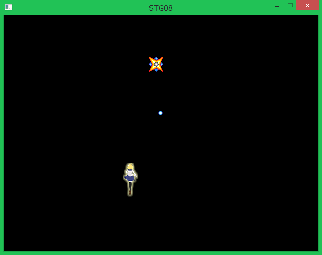
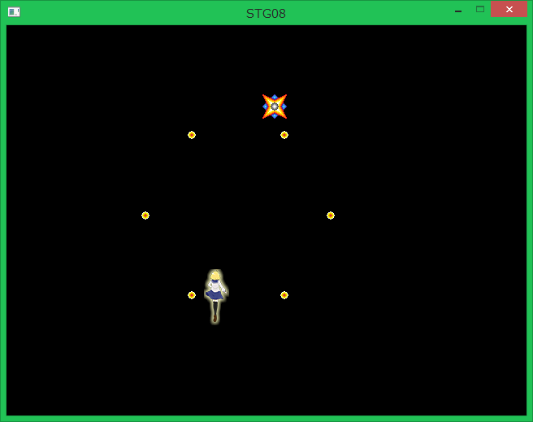

## 08. 複雑な敵の動き

### 概要

前回までの内容で、敵の弾と作って敵がそれを撃ってくるようにしました。今回は第5回にて紹介した継承を用いて異なる動きをする様々な敵や弾を作りましょう。方針としては```Enemy```クラス並びに```EnemyBullet```クラスを継承することで作っていきます。

### 既存の```Enemy```クラスを新規継承クラスに切り分けて、最低限のものにする。

ここで、今後の複雑な敵を実装するクラスの継承元となる```Enemy```クラスの内容を一回見返してみましょう。このクラスの挙動は前回の講習の内容によると、「一方向に対して移動し続けて60フレームに一回プレイヤーの周囲に向かって3発の弾を撃つ」というものです。
この```Enemy```クラスの持つパラメータと機能の要素をざっとまとめると以下のようになります。

パラメータ
* 初期位置
* 速度ベクトル(```moveVelocity```)
* Playerクラスへの参照
* 描画されるテクスチャ画像

更新処理
* 一方向に対して移動し続ける
* 60フレームに一回自機周辺めがけて3発の弾を撃つ
* 画面外に出た時に削除される
* 1フレームごとに1増加するカウンタ変数

パラメータに関しては、移動処理のみに依存している速度ベクトルを除いてそれなりに使えそうです。更新処理については、カウンタ変数を除いて使いまわすことはない感じがしますね。画面外に出た時の削除はものにもよりますが一度画面外に出てから再び画面内に戻ってくるような挙動の敵を作ることも十分ありえます。
これを踏まえて、```Enemy```の内容を使いまわしている物のみの最低限に減らし、一方向に対して移動し続けて射撃を行うという内容は新たなクラス```StraightMovingEnemy```に切り分けましょう。

まずは、```Enemy```の内容を最小限に減らしてみましょう。この時既存のEnemyの内容はメモ帳か何かに貼っ付けて避難させといて下さい。

```cs
using System;
using System.Collections.Generic;
using System.Linq;
using System.Text;
using System.Threading.Tasks;

namespace STG
{
    public class Enemy : ace.TextureObject2D
    {
        //毎フレーム1増加し続けるカウンタ変数（継承先のクラスで使いまわすため、protectedに設定する。）
        protected int count;

        //プレイヤーへの参照（継承先のクラスで使いまわすため、protectedに設定する。）
        protected Player player;

        //コンストラクタ(敵の初期位置を引数として受け取る。)
        public Enemy(ace.Vector2DF pos, Player player)
            : base()
        {
            //現在地を初期位置を設定。
            Position = pos;

            //敵のテクスチャに使用する画像を読み込んで、設定。
            Texture = ace.Engine.Graphics.CreateTexture2D("Resources/Enemy.png");

            //カウンタ変数を0に初期化
            count = 0;

            //Playerクラスへの参照を保持
            this.player = player;

            //敵のテクスチャの描画原点を、画像の中心に設定する。
            CenterPosition = new ace.Vector2DF(Texture.Size.X / 2.0f, Texture.Size.Y / 2.0f);
        }

        protected override void OnUpdate()
        {
            ++count;
        }
		
		//画面外に出た時に削除する関数。
		protected void VanishFromLayer()
		{
            // 画面外に出たら
            var windowSize = ace.Engine.WindowSize;
            if (Position.Y < -Texture.Size.Y || Position.Y > windowSize.Y + Texture.Size.Y || Position.X < -Texture.Size.X || Position.X > windowSize.X + Texture.Size.X)
            {
                // 削除する。
                Vanish();
            }
		}
    }
}
```

まず、コンストラクタに関しては、速度ベクトルを設定するという仕様が削られるため、引数から除外されます。よって引数にて指定する項目は初期位置と自機クラスへの参照の2つとなります。これに加えてカウンタの初期値ならびにテクスチャ画像と描画原点を設定する処理を行うと```Enemy```クラスが持つ機能の全ての初期化が終わります。
ここで気をつけなければいけないのは、カウンタ変数と自機への参照変数のアクセシビリティが以前は```private```だったのを```protected```に変更したことです。変更した理由としては、```private```で宣言した変数ならびにメソッドはその宣言を行ったクラス内からしか参照できずに継承先のクラスで使いまわせないのですが、それを```protected```に変更することでその変数ならびにメソッドを宣言したクラスを継承する、新たなクラスからもその変数が参照可能となるようにするためです。
また、オブジェクトが画面外に出た時にレイヤーから削除する処理は継承後のクラスで使用する可能性があるため、```protected```のメソッド```VanishFromLayer()```として継承後のクラス内から使用できるようにしました。

続いて、一直線に向かって動き続け、60フレームに一回自機に向かって3発の弾を撃つという以前の```Enemy```クラスの内容を```StraightMovingEnemy```という新しいクラスに切り分けます。```StraightMovingEnemy.cs```を作成し、以下のように記述してください。

```cs
using System;
using System.Collections.Generic;
using System.Linq;
using System.Text;
using System.Threading.Tasks;

namespace STG
{
    public class StraightMovingEnemy : Enemy
    {
        //速度ベクトル
        private ace.Vector2DF moveVector;

        //コンストラクタ(敵の初期位置、移動ベクトルならびにプレイヤーへの参照を引数として受け取る。)
        public StraightMovingEnemy(ace.Vector2DF pos, ace.Vector2DF movevector, Player player)
            : base(pos,player)
        {
            //速度ベクトルを設定
            moveVector = movevector;
        }

        protected override void OnUpdate()
        {
            //速度ベクトル分移動する。
            Position += moveVector;
			
			VanishFromLayer();

            //カウンタ変数が60の倍数の時
            if (count % 60 == 0)
            {
                //自分の位置から自機の位置へ対するベクトルを計算。
                ace.Vector2DF dir = player.Position - Position;

                //ベクトルの長さを1.5に変更。
                ace.Vector2DF moveVelocity = dir.Normal * 1.5f;

                //弾を発射する。
                Layer.AddObject(new EnemyBullet(Position, moveVelocity));

                //moveVelocityを時計方向に10.0度回転させたベクトルmoveVelocity2を作成。
                ace.Vector2DF moveVelocity2 = moveVelocity;
                moveVelocity2.Degree += 10.0f;

                //moveVelocity2を速度ベクトルとして弾を発射する。
                Layer.AddObject(new EnemyBullet(Position, moveVelocity2));

                //moveVelocityを反時計方向に10.0度回転させたベクトルmoveVelocity3を作成。
                ace.Vector2DF moveVelocity3 = moveVelocity;
                moveVelocity3.Degree -= 10.0f;

                //moveVelocity3を速度ベクトルとして弾を発射する。
                Layer.AddObject(new EnemyBullet(Position, moveVelocity3));
            }

            //カウンタの増加機能を使いまわすため基底(Enemy)クラスのOnUpdateを呼び出す。
            base.OnUpdate();
        }
    }
}
```

このように、```Enemy```クラスの内容は今後共有する初期位置や自機への参照など最小限の情報に減らされ、敵としての挙動とそれのみに必要な情報は```StraightMovingEnemy```クラスに切り分けられました。前回のサンプルではProgram.csに記述された```Main```関数内にて```Enemy```クラスのインスタンスを生成していましたが、ちゃんと動きを示す```StraightMovingEnemy```クラスに変更する必要がありますね。そこで以下のように変更して下さい。

```diff
～省略～
		// レイヤーに自機オブジェクトを追加する。
		layer.AddObject(player);

		//敵オブジェクトを生成する。(速度ベクトル : (0.5,0))
-		Enemy enemy = new Enemy(new ace.Vector2DF(10, 100), new ace.Vector2DF(0.5f, 0), player);
+		Enemy enemy = new StraightMovingEnemy(new ace.Vector2DF(10, 100), new ace.Vector2DF(0.5f, 0), player);
		//レイヤーに敵オブジェクトを追加する。
		layer.AddObject(enemy);

		// シーンを切り替える。
		ace.Engine.ChangeScene(scene);
～省略～
```

これで、前回のサンプルProjectと同様の挙動が得られると思います。

大分すっきりしましたね。今後は、この```StraightMovingEnemy```クラスが```Enemy```クラスを継承して自分独自の挙動を定義してるのに習って、```Enemy```クラスを継承して様々な動きをする敵を作っていきましょう。

### 自機に突進してくる敵

まずは、自機に突進してくる敵を実装してみましょう。具体的には、一定時間かけて自機に突進してくる→一定時間停止する　をくり返すという挙動となります。

ソースファイル```RushingEnemy.cs```を作成し、以下のように書いてください。

```cs
using System;
using System.Collections.Generic;
using System.Linq;
using System.Text;
using System.Threading.Tasks;

namespace STG
{
    public class RushingEnemy :Enemy
    {
        //移動の際の速度ベクトル。
        private ace.Vector2DF moveVelocity;

        public RushingEnemy(ace.Vector2DF pos,Player player)
            :base(pos, player)
        {
            //速度ベクトルベクトルを初期化。
            moveVelocity = new ace.Vector2DF();
        }

        protected override void OnUpdate()
        {
            //カウンタ変数を120で割った値を求める。
            int mod = count % 120;

            //mod = 0のとき
            if (mod == 0)
            {
                //その時点での自機に向かう速度ベクトルを求める。
                moveVelocity = (player.Position - Position).Normal * 5.0f;
            }
            else if (mod <= 60) // 1 <= mod <= 60 のとき
            {
                //速度ベクトルをPositionに加算して移動する。
                Position += moveVelocity;
            }

			//カウンタの増加機能を使いまわすため基底(Enemy)クラスのOnUpdateを呼び出す。
            base.OnUpdate();
        }
    }
}
```

この```RushingEnemy```は```Enemy```を基底クラスとして継承することで作成します。継承することによって、基底クラスの変数やメソッドを使いまわすことが可能です。このクラスでは基底クラスで宣言済みのPlayerクラスへの参照を示す```player```並びに毎フレームごとに値が増えていくカウンタ変数```count```を使いまわします。

具体的には、カウンタ変数の値を120で割った余りを求め、その値に応じて以下の様な動きをさせます。

* 0 : 速度ベクトル```moveVector```をその時点での自機の位置に向かって毎フレーム5.0移動するように設定する。
* 1 ~ 60 : ```Position```変数に毎フレーム```moveVector```を加算することで移動する。
* 61 ~ 119 : 停止する。（何もしない。）

それでは、```Program.cs```の```Main```関数を変更して、この敵をゲームに登場させましょう。

```diff
～省略～

	// レイヤーに自機オブジェクトを追加する。
	layer.AddObject(player);

-	//敵オブジェクトを生成する。速度ベクトル : (0.5,0))
-	Enemy enemy = new StraightMovingEnemy(new ace.Vector2DF(10, 100), new ace.Vector2DF(0.5f, 0), player);
-	//レイヤーに敵オブジェクトを追加する。
-	layer.AddObject(enemy);
		
+	//突進する敵オブジェクトを生成する。
+	RushingEnemy rushingEnemy = new RushingEnemy(new ace.Vector2DF(320, 100), player);
+	//レイヤーに突進する敵オブジェクトを追加する。
+	layer.AddObject(rushingEnemy);

	// シーンを切り替える。
	ace.Engine.ChangeScene(scene);

～省略～
```

実行すると、以下に示すように敵が自機めがけて突進→停止を一定の間隔でくり返すことが確認できます。


### 反復して移動する敵

続いて、左右に反復して移動する敵を作りましょう。今回は三角関数を使って、方向転換が近い時に減速し、逆方向に行った瞬間から加速し始めるような挙動にしてみます。

ソースファイル```GentlyMovingEnemy.cs```を作成し、以下のように書いてください。

```cs
using System;
using System.Collections.Generic;
using System.Linq;
using System.Text;
using System.Threading.Tasks;

namespace STG
{
    public class GentlyMovingEnemy : Enemy
    {
        //移動の際の基準となる位置。
        private ace.Vector2DF basePosition;

        public GentlyMovingEnemy(ace.Vector2DF pos, Player player)
            : base(pos, player)
        {
            //移動の際の基準となる位置を初期化
            basePosition = pos;
        }

        protected override void OnUpdate()
        {
            //basePositionに(X,Y) = ( sin(count*2) , 0 )のベクトルをX,Y成分それぞれ50.0倍した結果を新たな位置とする。
            Position = basePosition + 50.0f * new ace.Vector2DF((float)Math.Sin((count * 2) * Math.PI / 180.0f), 0);

			//カウンタの増加機能を使いまわすため基底(Enemy)クラスのOnUpdateを呼び出す。
            base.OnUpdate();
        }
    }
}
```

この動きを実現するにあたって、三角関数のsinを使用するのですが、こちらはC#の標準ライブラリに含まれている数学関数のSinを使用します。これは名前空間```System```内に宣言された静的クラス```Math```内に書かれています。
[MSDNに記されているSin関数の記事](https://msdn.microsoft.com/ja-jp/library/system.math.sin(v=vs.110).aspx)を見てみましょう。どうやらラジアン値を引数```(a)```として与えると、```sin(a)```が返ってくる関数のようです。

さて、Sinに引数として与える```count*2```は度数値なのでラジアン値に変換する必要があります。変換するには度数値をdとして以下のようにします。

```
 r = d * π / 180
```

上の式の```π```は```Math.PI```に定義されているのでそれを使用します。上記の変換式で変換した値をMath.Sinに与えるとその計算した値が返り値として返ってくるのですが、その返り値の型はdouble型となっております。この値をace.Vector2DFのコンストラクタで渡すのですが、その引数はいずれもfloat型となっています。C#においてdouble型からfloat型への暗黙的な型変換は許されていないため、その変換を明示する必要があります。
これらを踏まえて、以下に示すようにして明示的なキャストによりSinの返り値の値をfloat型に変換します。

```
(float)Math.Sin((count * 2) * Math.PI / 180.0f)
```

これで```basePosition```に加算するベクトルが準備出来ました。三角関数sinの値の値域は-1～+1なので、その値域が-50～+50になるよう```50.0f```を乗算します。この最終的な値を```basePosition```に加算した結果を敵の位置とすることで完成です。

それでは、この反復して移動する敵の三角関数版も以下のように```Program.cs```の```Main```関数を一部変更することでゲーム上に登場させましょう。

```diff
～省略～

	// レイヤーに自機オブジェクトを追加する。
	layer.AddObject(player);

	//突進する敵オブジェクトを生成する。
	RushingEnemy rushingEnemy = new RushingEnemy(new ace.Vector2DF(320, 100), player);
	//レイヤーに突進する敵オブジェクトを追加する。
	layer.AddObject(rushingEnemy);

+	//反復して移動する敵オブジェクトを生成する。
+	GentlyMovingEnemy gentlyMovingEnemy = new GentlyMovingEnemy(new ace.Vector2DF(320, 100), player);
+	//レイヤーに反復して移動する敵オブジェクトを追加する。
+	layer.AddObject(gentlyMovingEnemy);

	// シーンを切り替える。
	ace.Engine.ChangeScene(scene);

～省略～
```

実行結果を見ると、以下に示すように突進する敵と新・反復して動く敵が表示されているのが分かります。



### 渦状に弾を拡散する

渦上に弾を拡散する敵を実装してみましょう。```Enemy```クラスに下に示すような```VortexShot()```メソッドを追加してください。

```cs
protected void VortexShot(float degree)
{
	ace.Vector2DF dirVector = new ace.Vector2DF(1, 0);
	dirVector.Degree = degree;
	Layer.AddObject(new EnemyBullet(Position, dirVector));
}
```

次に、このメソッドを呼び出すことで実際に弾を発射する敵を作りましょう。```VortexShotEnemy.cs```を作成し、以下に示すようにして```VortexShotEnemy```クラスを定義してください。

```cs
using System;
using System.Collections.Generic;
using System.Linq;
using System.Text;
using System.Threading.Tasks;

namespace STG
{
    public class VortexShotEnemy :Enemy
    {
        public VortexShotEnemy(ace.Vector2DF pos, Player player)
            : base(pos, player)
        {

        }

        protected override void OnUpdate()
        {
            //渦ショット
            if (count % 2 == 0)
            {
                VortexShot(count * 10);
            }
			
			//カウンタの増加機能を使いまわすため基底(Enemy)クラスのOnUpdateを呼び出す。
            base.OnUpdate();
        }
    }
}
```

もうおなじみの```Program.cs```の```Main```関数の一部を以下のように書き換えて``VortexShotEnemy```をゲーム上に登場させます。

```diff
～省略～

	// 自機オブジェクトを生成する。
	Player player = new Player();

	// レイヤーに自機オブジェクトを追加する。
	layer.AddObject(player);

-	//反復して移動する敵オブジェクトを生成する。
-	GentlyMovingEnemy gentlyMovingEnemy = new GentlyMovingEnemy(new ace.Vector2DF(320, 100), player);
-	//レイヤーに反復して移動する敵オブジェクトを追加する。
-	layer.AddObject(gentlyMovingEnemy);
	
+	//渦状に弾を撃つ敵オブジェクトを生成する。
+	VortexShotEnemy vortexShotEnemy = new VortexShotEnemy(new ace.Vector2DF(320.0f, 240.0f), player);
+	//レイヤーに渦状に弾を撃つ敵オブジェクトを追加する。
+	layer.AddObject(vortexShotEnemy);

	// シーンを切り替える。
	ace.Engine.ChangeScene(scene);

～省略～
```

これも実行して結果を見てみましょう。以下に示すようにうず上に弾を撃つ敵が画面の中心に現れて弾を渦状に撃っているのが分かります。



### 分裂する弾

最後に、```EnemyBullet```クラスを継承して分裂する弾を作ってみましょう。```SplitEnemyBullet.cs```を作って```SplitEnemyBullet```クラスを以下のように定義しましょう。

```diff
using System;
using System.Collections.Generic;
using System.Linq;
using System.Text;
using System.Threading.Tasks;

namespace STG
{
    public class SplitEnemyBullet :EnemyBullet
    {
        //1フレームごとに1増加していくカウンタ変数。
        private int count;

        //分裂するときのカウンタの値を保存する変数。
        private int splitCount;

        public SplitEnemyBullet(ace.Vector2DF startPos, ace.Vector2DF moveVector, int splitcount)
            : base(startPos, moveVector)
        {
            //カウンタの初期値を0に設定。
            count = 0;

            //分裂するときのカウンタの値を設定。
            splitCount = splitcount;

            //分裂する弾独自のテクスチャを設定する。
            Texture = ace.Engine.Graphics.CreateTexture2D("Resources/SplitEnemyBullet.png");
        }

        protected override void OnUpdate()
        {
            //基底クラス(EnemyBullet)のOnUpdateメソッド内にある毎フレーム速度ベクトル分移動する処理と
            //画面外に出た時に消去する処理は使いまわせるので、使いまわす。
            base.OnUpdate();

            //カウンタの値が分裂時の値に達した時。
            if (splitCount==count)
            {
                //全6方向に対して弾(EnemyBullet)を発射する。
                for(int i=0;i<6;++i)
                {
                    ace.Vector2DF dir = new ace.Vector2DF(1, 0);
                    dir.Degree = i * 60;
                    Layer.AddObject(new EnemyBullet(Position, Position + dir));
                }

                //これ自身は消去する。
                Vanish();
            }
            ++count;
        }
    }
}
```

このクラスを定義するにあたって継承前のクラスと比べてコンストラクタの引数が一つ増えています。この引数を通じて何フレーム目に弾が分裂するかを設定します。コンストラクタにてTexture変数にテクスチャを設定していますが、この処理を書くことによって使用するテクスチャを```EnemyBullet```に使用している物から独自の物に変更することが出来ます。
細かく説明すると、基底クラスのコンストラクタが呼ばれた後に当該クラスのコンストラクタが呼び出されるので、```EnemyBullet```クラスコンストラクタ内の```Texture = ace.Engine.Graphics.CreateTexture2D("Resources/EnemyBullet.png");```が呼び出された後、```Texture = ace.Engine.Graphics.CreateTexture2D("Resources/SplitEnemyBullet.png");```が呼び出されることで、その内容は上書きされます。
続いて、```OnUpdate()```メソッドについては、基底クラス(```EnemyBullet```)の```OnUpdate()```内の移動処理と画面外に出た時の消去処理を使いまわせるため、```base.OnUpdate()```メソッドを用いて呼び出します。
この```SplitEnemyBullet```自体の処理としては、```count```の値を毎フレームごとに1増やし続け、```splitCount```の値と同値になった時に分裂します。分裂後の弾は360度全方向に60度の間隔で計6発出ます。そしてこの分裂前の```SplitEnemyBullet```オブジェクト自体はその瞬間に削除します。

さて、この弾を撃つ処理も```Enemy```クラスの継承先全体から使えるようにしましょう。```Enemy```クラスに以下の内容を書き加えてください。
```cs
protected void SplitShot(int splitCount)
{
	//自機に向かって分裂する弾を撃つ。(速度ベクトルの長さは5.0でsplitCountで指定した回数フレームが経過すると分裂)
	ace.Vector2DF　dir = player.Position - Position;
	ace.Vector2DF moveVector = dir.Normal * 5.0f;
	Layer.AddObject(new SplitEnemyBullet(Position, moveVector, splitCount));
}
```

さて、この弾は```GentlyMovingEnemy```に撃たせてみましょう。```GentlyMovingEnemy.cs```を以下のように変更してください。分裂するのは撃ってから45フレーム後とします。

```diff
using System;
using System.Collections.Generic;
using System.Linq;
using System.Text;
using System.Threading.Tasks;

namespace STG
{
    public class GentlyMovingEnemy : Enemy
    {
        //移動の際の基準となる位置。
        private ace.Vector2DF basePosition;

        public GentlyMovingEnemy(ace.Vector2DF pos, Player player)
            : base(pos, player)
        {
            //移動の際の基準となる位置を初期化
            basePosition = pos;
        }

        protected override void OnUpdate()
        {
            //basePositionに(X,Y) = ( sin(count*2) , 0 )のベクトルをX,Y成分それぞれ50.0倍した結果を新たな位置とする。
            Position = basePosition + 50.0f * new ace.Vector2DF((float)Math.Sin((count * 2) * Math.PI / 180.0f), 0);

+			//240フレームに一回分裂する弾を撃つ。(分裂するのは発射してから45フレーム経過後)
+           if (count % 240 == 0)
+           {
+              SplitShot(45);
+           }

            //カウンタの増加機能を使いまわすため基底(Enemy)クラスのOnUpdateを呼び出す。
            base.OnUpdate();
        }
    }
}
```

でもって、おなじみ```Main```関数を以下のように変更です。

```diff
～省略～

	// 自機オブジェクトを生成する。
	Player player = new Player();

	// レイヤーに自機オブジェクトを追加する。
	layer.AddObject(player);

-	//渦状に弾を撃つ敵オブジェクトを生成する。
-	VortexShotEnemy vortexShotEnemy = new VortexShotEnemy(new ace.Vector2DF(320.0f, 240.0f), player);
-	//レイヤーに渦状に弾を撃つ敵オブジェクトを追加する。
-	layer.AddObject(vortexShotEnemy);

+	//敵オブジェクトを生成する。
+	GentlyMovingEnemy gentlyMovingEnemy = new GentlyMovingEnemy(new ace.Vector2DF(320.0f, 100.0f), player);
+	//敵オブジェクトを追加する。
+	layer.AddObject(gentlyMovingEnemy);

	// シーンを切り替える。
	ace.Engine.ChangeScene(scene);

～省略～
```

実行すると、下に示した一つ目のスクリーンショットのように青い弾が出てきた後に、二つ目のスクリーンショットに示したように青い弾が消えて6つの弾に分裂します。





### まとめ

本章では、いろんな動きの敵や敵の弾を作りました。次回は、自機や敵が衝突したか否かを調べる当たり判定を実装しましょう。

