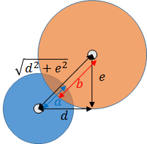

## 09. 当たり判定を実装してみよう

### 概要

前回までの内容で、複雑な動きをする敵がいくつか増えました。
しかし、依然として「自機が敵の弾に当たっても」「敵が自機の弾に当たっても」何も起こらず、これではどうもゲームらしくないですね。

そこで今回は、シューティングゲームにおいて最も重要な「当たり判定」の書き方を解説していきたいと思います。

### 「当たり判定」とは

「当たり判定」とは読んで字の如く、オブジェクト同士が当たっているかどうか判定するものです。当たり判定の実装方法には色々な手法が考えられますが、今回は簡単のために「円同士の当たり判定をピクセル単位で取る」という方法を扱います。

例えば下のような２つの円のオブジェクトを考え、２つの円の中心座標を考えてみましょう。２つの円の半径をa, bとおき、２つの円のx座標の差をd、y座標の差をeとおくと、中学校で習うような「三平方の定理」よりd^2+e^2<(a+b)^2ならば２つの円は「ぶつかっている」ということになりますね。



ちなみに、Altseedには衝突判定の機能がありますが、今回は講座ということで自分で実装しています。

### 当たり判定を持つクラス

まず、当たり判定を持つクラスを用意しましょう。

今回は、「プレイヤーと敵の弾」、「敵と自機の弾」が衝突してほしいので、 `Player` 、 `Bullet` 、 `Enemy` 、 `EnemyBullet`　のそれぞれが当たり判定を持つクラスになります。

いままでこれらのクラスは`asd.TextureObject2D`を継承して画像を表示していましたが、更に当たり判定の機能を全てのクラスにつけるために`CollidableObject`というクラスを作って、このクラスを継承します。

`CollidableObject` は `asd.TextureObject2D` を継承するので、画像を表示することもできます。

では、当たり判定を持つクラスが実装すべきものを決めましょう。

* 位置座標
* 半径
* 相手と衝突したかどうか
* 相手と衝突したときの処理

この4つを実装したクラスを作ります。

それでは、プロジェクトに新規追加で`CollidableObject.cs`を追加して、`CollidableObject`を以下のように書きましょう。

```cs
using System;
using System.Collections.Generic;
using System.Linq;
using System.Text;
using System.Threading.Tasks;

namespace STG
{
	// 衝突判定を持つTextureObject2D
	public class CollidableObject : asd.TextureObject2D
	{
		// 半径
		public float Radius = 0.0f;

		// 引数に指定したCollidableObjectと自分が衝突しているか、を返す。
		public bool IsCollide(CollidableObject o)
		{
			// 二点間の距離 が お互いの半径の和 より小さい場合にはtrueを返す。
			return (o.Position - Position).Length < Radius + o.Radius;
		}

		// 衝突時の処理を行うメソッドを実装する。
		public override void OnCollide(CollidableObject obj)
		{

		}
	}
}
```

* 半径は `Radius`
* 当たり判定は `IsCollide`
* 当たった時の処理は `OnCollide` 

としました。

半径として `Radius` を宣言しています。これは普通のメンバ変数です。

当たり判定のメソッドとして`IsCollide`を実装しています。内容は先ほど説明した円と円の衝突を判定する計算式に従って記述します。

`(obj.Position - Position).Length` では、位置座標のベクトルの差をとって、その大きさ（スカラー）をとることで、二点間の距離を得ています。

`Radius + obj.Radius` では、お互いの半径の和をとってます。この半径は、当たり判定に使うために用意された円の半径です。

お互いの円が、その表面で接している状態というのは、「二点間の距離」と「お互いの半径の和」が等しい状態です。距離がこれ以上縮まってしまうと衝突します。そこで、距離が縮まってしまった場合には衝突したという bool (真偽)を返すようにします。

当たった時の処理のメソッドとして `OnCollide` を実装していますが、内容はありません。この処理は継承先のクラスで実装します。

このメソッドには `override` という修飾子があります。これは、実装はしているが、子クラスがこのメソッドを `override` (上書き)することを認める記述です。

基本的な動作は決まっているが、子クラスでもメソッドを工夫する可能性がある場合に使えるキーワードです。

このメソッドの内部は後ほど実装することにしましょう。


### 当たり判定を持つクラスへの切り替え

次に、各クラスを `CollidableObject` クラスから継承するようにしていきます。

`Player` クラス

```diff
-public class Player : asd.TextureObject2D
+public class Player : CollidableObject
```

`Enemy` クラス

```diff
-    public class Enemy : asd.TextureObject2D
+    public class Enemy : CollidableObject
```

`Bullet` クラス

```diff
-    class Bullet : asd.TextureObject2D
+    class Bullet : CollidableObject
```

`EnemyBullet` クラス

```diff
-    public class EnemyBullet : asd.TextureObject2D
+    public class EnemyBullet : CollidableObject
```

このままでは半径が0のままなので、半径を設定するようにします。
半径は画像の大きさを元に決めるようにします。

`Player` クラス

```diff

	public Player()
	{
		// 画像を読み込み、プレイヤーのインスタンスに画像を設定する。
		Texture = asd.Engine.Graphics.CreateTexture2D("Resources/Player.png");

		// プレイヤーのインスタンスに画像の中心位置を設定する。
		CenterPosition = new asd.Vector2DF(Texture.Size.X / 2.0f, Texture.Size.Y / 2.0f);

		// プレイヤーのインスタンスの位置を設定する。
		Position = new asd.Vector2DF(320, 480);

+		// プレイヤーの Radius は小さめにしておく
+		Radius = Texture.Size.X / 8.0f;
	}
```

`Enemy` クラス

```diff
	//コンストラクタ(敵の初期位置を引数として受け取る。)
	public Enemy(asd.Vector2DF pos, Player player)
		: base()
	{
		// 敵のインスタンスの位置を設定する。
		Position = pos;
		
		//　画像を読み込み、敵のインスタンスに画像を設定する。
		Texture = asd.Engine.Graphics.CreateTexture2D("Resources/Enemy.png");
		
		// 敵のインスタンスに画像の中心位置を設定する。
		CenterPosition = new asd.Vector2DF(Texture.Size.X / 2.0f, Texture.Size.Y / 2.0f);
		
+		// 画像の半分の大きさを Radius とする
+ 		Radius = Texture.Size.X / 2.0f;

		// カウンタ変数を0に初期化する。
		count = 0;
		
		// Playerクラスへの参照を保持する。
		this.player = player;
	}
```

`Bullet` クラス

```diff
	public Bullet(asd.Vector2DF position)
	{
		// 画像を読み込み、弾のインスタンスに画像を設定する。
		Texture = asd.Engine.Graphics.CreateTexture2D("Resources/PlayerBullet.png");

		// 弾のインスタンスに画像の中心位置を設定する。
		CenterPosition = new asd.Vector2DF(Texture.Size.X / 2.0f, Texture.Size.Y / 2.0f);

		// 弾のインスタンスの位置を設定する。
		Position = position;

+		// 画像の半分の大きさを Radius とする
+		Radius = Texture.Size.X / 2.0f;
	}
```


`EnemyBullet` クラス

```diff
	// コンストラクタ(敵の初期位置を引数として受け取る。)
	public EnemyBullet(asd.Vector2DF pos)
		: base()
	{
		// 敵弾のインスタンスの位置を設定する。
		Position = pos;
		
		//　画像を読み込み、敵弾のインスタンスに画像を設定する。
		Texture = asd.Engine.Graphics.CreateTexture2D("Resources/EnemyBullet.png");
		
		// 敵弾のインスタンスに画像の中心位置を設定する。
		CenterPosition = new asd.Vector2DF(Texture.Size.X / 2.0f, Texture.Size.Y / 2.0f);

+		// 画像の半分の大きさを Radius とする
+		Radius = Texture.Size.X / 2.0f;
	}
```

### OnCollideの実装

`OnCollide` は、 `IsCollide` がtrueとなった場合に起きる行動(衝突時の処理)
です。

わかりやすいように、衝突してしまったら「弾」も「機体」も消滅するようにしてみましょう。

`Enemy` 、 `EnemyBullet` クラスに以下のような編集をします。

```cs
        // 衝突時の動作(子クラスでoverrideが可能)
        public override void OnCollide(CollidableObject obj)
        {
            // ゲームからオブジェクトを消滅させる
            Dispose();
        }
```

`Player` 、 `Bullet` クラスにも以下のような編集をしましょう。

```cs
        // 衝突時の動作
        public override void OnCollide(CollidableObject obj)
        {
            // ゲームからオブジェクトを消滅させる
            Dispose();
        }
```

これで、 `OnCollide` の実装は終わりです。あと少しです。実装された`IsCollide` 、 `OnCollide`を用いて当たり判定を反映させましょう。

### プレイヤーと敵の弾、敵とプレイヤーの弾に当たり判定をつける

プレイヤーがダメージを受けるのは敵の弾、敵がダメージを受けるのはプレイヤーの弾なので相互に当たり判定の関係をつくりましょう。

まず、 `Enemy` クラスに、 `CollideWith(CollidableObject obj)` メソッドを追加します。このメソッドは、`IsCollide` 、 `OnCollide`を用いて、当たり判定を実際に反映させるためのものです。

```cs
        // 自機の弾との当たり判定をコントロールするメソッド
        protected void CollideWith(CollidableObject obj)
        {
            // 当たり判定の相手が見つかってない場合はメソッドを終了
            if (obj == null)
                return;

            // obj が Bulletである場合にのみelse内を動作させる
            if (obj is Bullet)
			{
            	// obj が bullet であることを明示
                CollidableObject bullet = obj;

                // bulletと衝突した場合には、衝突時処理を行う
                if (IsCollide(bullet))
                {
                    OnCollide(bullet);
                    bullet.OnCollide(this);
                }
            }
        }
```

ここで、新しく `obj is Bullet` という式が登場しました。これは**is演算子**という機能で、ここでは`obj`が`Bullet`クラスのインスタンスであるかどうかを判定しています。`obj`が`Bullet`クラスのインスタンスであればこの式は`true`を返すので、if文の中へ処理が入っていきます。

次に、 `Enemy` クラスの `Onupdate` メソッドを編集して、以下のようにします。

```cs
        protected override void OnUpdate()
        {
            // 当たり判定を処理する
            foreach (var obj in Layer.Objects)
                CollideWith((obj as CollidableObject));

            ++count;
        }
```

ここで、foreachとはfor文の拡張で、

	foreach (var obj in Layer.Objects)

というのは、 「 `Layer.Objects` の要素をとりだして、 `obj` と名前を付ける」 ことを`Layer.Objects` の全要素について行ってくれます。

ところで、`Layer.Objects` についてですが、レイヤーという考えを用いています。詳しくはこれより後の章で述べられますが、意味合いとしては、

「このオブジェクト(Enemyクラスのインスタンス)を登録した場所( `Layer` )に登録されているオブジェクト群( `Objects` )を取得する」

といった感じです。「ゲーム中に出てくるオブジェクトを全て取得する」と読み替えても、現段階では差し支えないです。

つまり、`Layer.Objects` の要素の中には、`Player` 、 `Bullet` 、 `Enemy` 、 `EnemyBullet` それぞれのクラスのインスタンスが含まれていることになります。これを用いて、当たり判定がとれるようになります。

そして、 `obj as CollidableObject` を `CollideWith` メソッドに渡すことで 当たり判定を実装します。
`null` をメソッドに渡してしまった場合は、それをメソッドが検知して終了する仕組みになっています。

これらによって、 `Enemy` クラスは以下のように編集されます。

```diff
public abstract class Enemy : CollidableObject
    {
        //毎フレーム1増加し続けるカウンタ変数（継承先のクラスで使いまわすため、protectedに設定する。）
        protected int count;

        //プレイヤーへの参照（継承先のクラスで使いまわすため、protectedに設定する。）
        protected Player player;

        // 
        public float Radius { get; set; }

        //コンストラクタ(敵の初期位置を引数として受け取る。)
        public Enemy(asd.Vector2DF pos, Player player)
            : base()
        {
        	...(省略)...
        }

        

        protected override void OnUpdate()
        {
+            // 当たり判定を処理する。
+            foreach (var obj in Layer.Objects)
+                CollideWith((obj as CollidableObject));

            ++count;
        }

        ...(省略)...

        public virtual void OnCollide(CollidableObject obj)
        {
            Dispose();
        }

+        // 自機の弾との当たり判定をコントロールするメソッド
+        protected void CollideWith(CollidableObject obj)
+        {
+            // 当たり判定の相手が見つかってない場合はメソッドを終了
+            if (obj == null)
+                return;

+            // obj が Bulletである場合にのみelse内を動作させる
+            if (obj is Bullet)
+            {
+            	// obj が bullet であることを明示
+                CollidableObject bullet = obj;

+                // bulletと衝突した場合には、衝突時処理を行う
+                if (IsCollide(bullet))
+                {
+                    OnCollide(bullet);
+                    bullet.OnCollide(this);
+                }
+            }
+        }
    }
```

`Player` クラスも同様に編集します。当たり判定をする相手が `EnemyBullet` クラスのインスタンスであることに気を付けてください。

```diff
    public class Player : CollidableObject
    {
        public Player()
        {
        	...(省略)...
        }


        protected override void OnUpdate()
        {
+            foreach (var obj in Layer.Objects)
+                CollideWith(obj as CollidableObject);

            ...(省略)...
        }

        public void OnCollide(CollidableObject obj)
        {
            Dispose();
        }

+        // 敵の弾との当たり判定をコントロールするメソッド
+        protected void CollideWith(ICollidable obj)
+        {
+            // 当たり判定の相手が見つかってない場合はメソッドを終了
+            if (obj == null)
+                return;

+            // obj が EnemyBulletである場合にのみelse内を動作させる
+            if (obj is EnemyBullet)
+            {
+                // obj が enemyBullet であることを明示
+                CollidableObject enemyBullet = obj;

+                // bulletと衝突した場合には、衝突時処理を行う
+                if (IsCollide(enemyBullet))
+                {
+                    OnCollide(enemyBullet);
+                    enemyBullet.OnCollide(this);
+                }
+            }
+        }
    }
```

長い長いコーディングを経て、やっと当たり判定を実装することができました。実行してみると的敵の弾でプレイヤーが消滅したり、自機の弾で敵が消滅するのが確認できると思います。

`OnCollide` を変えれば消滅以外にも他の事ができますし、 `Radius` を変えれば当たり判定を広げたり縮めたりすることができます。

すべての変更を適用した結果をダウンロードできるようにしておきます。参考にしてください。

[プロジェクト(Windows)](Projects/STG09.zip?raw=true)

[プロジェクト(Mac)]

### まとめ

本章では、衝突判定を実装しました。ただ、衝突していきなり消滅するだけなので、次回では、衝突した時にエフェクトが発生するようにします。
