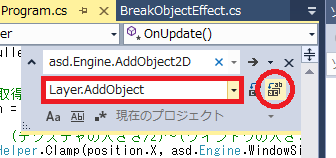

## 11. タイトル画面を実装してみよう

### 概要

前回までの内容で、一通りシューティングゲームの要素を実装しました。
しかし、このままでは普通最初に表示される「タイトル画面」等がなく、ゲームとして体裁が不十分な箇所が残っています。

そこで今回は「ゲームのタイトル画面」を実装し、プログラムを実行すると最初にタイトル画面が表示されるようにしたいと思います。

### シーン、レイヤー、オブジェクトという概念

ここまでは触れていなかったのですが、Altseedにより製作されるゲームは主にシーン、レイヤー、オブジェクトの3つの要素で構成されています。

シーンはロゴ画面、タイトル画面、ゲーム画面、ゲームオーバー画面といったゲームの画面を示します。シーン自体には画像を描画する機能はなく、実際に画像を表示するためにはシーンにレイヤーを登録する必要があります。レイヤーを複数保持しレイヤーを管理する機能を持っています。

レイヤーはキャラクタのHPなどのステータス等を表示しているUI、キャラクターが居るフィールドといったゲームの画面内の大まかな描画先を示します。レイヤー自体にも画像を表示する機能はなく、実際に画像を描画するためにはレイヤーにオブジェクトを登録する必要があります。オブジェクトを複数保持しオブジェクトを管理する機能を持っています。

オブジェクトはキャラクター、障害物、弾といったゲーム内の要素を示します。レイヤー内に存在するオブジェクトが実際に画像を表示します。沢山の種類があり、単純に画像を表示するものから文字やエフェクトを表示するオブジェクトもあります。

図で示すと以下のようになります。


さて、ここまでの文章で分かった方も多いかと思いますが、今回は「シーン」を追加することで「タイトル画面」を実装していきます。また、今後のことも考え、今まで実装していたゲームの部分についても「ゲーム画面」という１つのシーンにまとめてみましょう。

### シーンを増やしてみよう

まずは、今までのゲーム本体の部分について`GameScene`という１つのシーンにまとめてみましょう。
プロジェクトに`GameScene.cs`を追加し、以下のように書いてみてください。

```cs
using System;
using System.Collections.Generic;
using System.Linq;
using System.Text;
using System.Threading.Tasks;

namespace STG
{
	// ゲーム画面を表すシーン
	class GameScene : asd.Scene
	{
		protected override void OnStart()
		{
			// 2Dを表示するレイヤーのインスタンスを生成する。
			asd.Layer2D layer = new asd.Layer2D();

			// シーンにレイヤーのインスタンスを追加する。
			AddLayer(layer);

			// プレイヤーのインスタンスを生成する。
			Player player = new Player();

			// プレイヤーのインスタンスをレイヤーに追加する。
			layer.AddObject(player);

			// レイヤーに反復して移動する敵のインスタンスを生成する。
			layer.AddObject(new VortexShotEnemy(new asd.Vector2DF(320.0f, 100.0f), player));
		}
	}
}
```

`asd.Scene`を継承した`GameScene`クラスでは、`protected override void OnStart()`において、このシーンが始まった際に動作させる内容を記述しています。
レイヤーを新規に生成したり、シーンにレイヤーのインスタンスを追加したりする部分については初めて見るコードになるかと思いますが、プレイヤーのインスタンスを生成したり、敵のインスタンスを生成したりする部分に関しては、今まで`Program.cs`に書いてきた部分と似通っていますね。

ただし、1つだけ大きく異なる点があります。

今までプレイヤーのインスタンスを追加するためには`asd.Engine.AddObject2D`を用いていましたが、このメソッドは「プログラムの中で一番最初に生成したレイヤーにオブジェクトを追加する」というものですので、オブジェクトを追加するレイヤーを指定することが出来ません。
これを解消するために、レイヤー`layer`を指定し、直接そのレイヤーに対し`layer.AddObject()`を呼ぶことで、指定したレイヤーにプレイヤーや敵を追加できるようにしてあります。後ほど、今まで`asd.Engine.AddObject2D`を用いていた部分を、レイヤーを指定した方法に書き換えてみることにしましょう。

次に、タイトル画面となる部分について`TitleScene`という１つのシーンにまとめてみましょう。
プロジェクトに`TitleScene.cs`を追加し、以下のように書いてみてください。

```cs
using System;
using System.Collections.Generic;
using System.Linq;
using System.Text;
using System.Threading.Tasks;

namespace STG
{
	// タイトル画面を表すシーン
	class TitleScene : asd.Scene
	{
		protected override void OnStart()
		{
			// 2Dを表示するレイヤーのインスタンスを生成する。
			asd.Layer2D layer = new asd.Layer2D();

			// シーンにレイヤーのインスタンスを追加する。
			AddLayer(layer);

			// 背景画像を表示するオブジェクトのインスタンスを生成する。
			asd.TextureObject2D background = new asd.TextureObject2D();
			background.Texture = asd.Engine.Graphics.CreateTexture2D("Resources/Title.png");

			// レイヤーにオブジェクトのインスタンスを追加する。
			layer.AddObject(background);
		}

		protected override void OnUpdated()
		{
			// もし、Zキーを押したら{}内の処理を行う。
			if (asd.Engine.Keyboard.GetKeyState(asd.Keys.Z) == asd.KeyState.Push)
			{
				asd.Engine.ChangeSceneWithTransition(new GameScene(), new asd.TransitionFade(1.0f, 1.0f));
			}
		}
	}
}
```

基本的な部分は`GameScene`と似通っていますが、初出の`asd.Engine.ChangeSceneWithTransition(new GameScene(), new asd.TransitionFade(1.0f, 1.0f));` という部分について説明しておきます。
まず`asd.Engine.ChangeSceneWithTransition()`メソッドは、最初の引数として「遷移先のシーン」、次の引数として「何秒でフェードアウトし、何秒でフェードインするか」という情報を持つ`asd.TransitionFade`を持っています。```asd.TransitionFadeのコンストラクタは「フェードイン・フェードアウトにかける、float型の秒単位の時間」を引数にとっていますから、この例のようにフェードイン・フェードアウトにかける時間を設定してみましょう。
なお、この例では「Zキーを押した際に」フェードアウト・フェードインともに1.0秒かけて次のシーンに遷移することになっています。

### シーンを利用するコードに書き換えてみよう

さて、ここまでの作業で`GameScene`・`TitleScene`という2つのシーンができました。しかし、`GameScene.cs`ではどうやら今まで`Program.cs`に書いていたコードらしきものを再度書いているようですね。
まさに今皆さんが思っている通り、今まで`Program.cs`に書いていたコードの一部をこの`GameScene.cs`に移してしまおう、というのが最初の作業となるわけです。

というわけで、重複しているコードを消去しつつ、`GameScene`クラスを利用できるようにするために、`Program.cs`の`Program`クラスを以下のように書き換えてみましょう。

```diff
	class Program
	{
		[STAThread]
		static void Main(string[] args)
		{

			// Altseedを初期化する。
			asd.Engine.Initialize("STG", 640, 480, new asd.EngineOption());

-			Player player = new Player();

-			asd.Engine.AddObject2D(player);

-			asd.Engine.AddObject2D(new VortexShotEnemy(new asd.Vector2DF(320.0f, 100.0f), player));

			// タイトルのシーンのインスタンスを生成する。
+			TitleScene scene = new TitleScene();

			// シーンを遷移する。
+            asd.Engine.ChangeSceneWithTransition(scene, new asd.TransitionFade(0, 1.0f));

			// Altseedのウインドウが閉じられていないか確認する。
			while (asd.Engine.DoEvents())
			{
				// もし、Escキーが押されていたらwhileループを抜ける。
				if (asd.Engine.Keyboard.GetKeyState(asd.Keys.Escape) == asd.KeyState.Push)
				{
					break;
				}

				// Altseedを更新する。
				asd.Engine.Update();
			}

			// Altseedの終了処理をする。
			asd.Engine.Terminate();
		}
	}
```

上の`GameScene`クラスで記述している3行分の操作については、先述のとおり`GameScene.cs`で記述しているため、ここでは記述する必要がなくなったので削除します。

代わりに、`TitleScene scene = new TitleScene(); `という行を書き加えることで、上に記述した`TitleScene`のインスタンスを生成し、`asd.Engine.ChangeSceneWithTransition(scene, new asd.TransitionFade(0, 1.0f)); `という行によってプログラムを実行した際に`scene`、すなわち`TitleScene`のインスタンスが呼び出されるようになっているわけです。

次は先述した通り`asd.Engine.AddObject2D`を利用しているコードを一通り書き換えてみましょう。数が多いので、エディタの置換機能を利用してみます。

Visual Studioであれば、Ctrl+Hで「置換ダイアログ」を出すことが出来ます（恐らく、他のエディタでも同様の機能は実装されているはずです）。エディタ画面の右上に下図のような窓が表示されると思いますので、図のように上のテキストボックスに`asd.Engine.AddObject2D`、下のテキストボックスに`Layer.AddObject`と入力し、赤い丸で囲っているボタンをクリックしてください。すると、表記を一括で置換することが出来ます。



さて、ここまでのコードが書きあがったら、実際にプログラムを実行してみましょう。今までのように最初からゲーム画面が表示されるのではなく、最初に「GAME TITLE」と書かれた画面が表示されますが、Zキーを押すことで無事にゲーム画面に遷移できるようになっているはずです。

すべての変更を適用した結果をダウンロードできるようにしておきます。参考にしてください。

[プロジェクト(Windows)](Projects/STG11.zip?raw=true)

### まとめ

本章では、基本的な「フェードイン・フェードアウト」を用いたシーン遷移の概念と、「キーを押したらシーンを遷移する」という操作の実装方法について解説してきました。
次章では、これらのシーンに「ゲームオーバー画面」を追加し、自機がダメージを受けたらゲームオーバー画面に遷移するようなプログラムを書いてみましょう。

