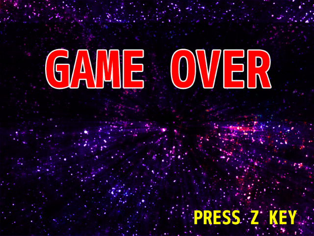

## 12. ゲームオーバー画面を実装してみよう

### 概要

前回までの内容で、ゲームのタイトル画面が実装できました。
見た目が一気にゲームらしくなって来たところで、今回は同様の考え方を使って「ゲームオーバー画面」を実装してみましょう。

### 下準備

さて、前回作ったタイトル画面と同じように、ゲームオーバー画面を実装してみます。
ゲームオーバー画面では「スコアを表示する」「ランキングを表示する」など様々な仕様が考えられますが、取り敢えずこの時点では「Zキーを押したらタイトル画面に移動する」ような処理を書いてみることにしましょう。基本的にタイトル画面と同じ実装になります。

新規にGameOverScene.csを作成し、以下のように記述してください。

```cs
using System;
using System.Collections.Generic;
using System.Linq;
using System.Text;
using System.Threading.Tasks;

namespace STG
{
	// ゲームオーバー画面を表すシーン
	class GameOverScene : asd.Scene
	{
		protected override void OnRegistered()
		{
			// 2Dを表示するレイヤーのインスタンスを生成する。
			asd.Layer2D layer = new asd.Layer2D();

			// シーンにレイヤーのインスタンスを追加する。
			AddLayer(layer);

			// 背景画像を表示するオブジェクトのインスタンスを生成する。
			asd.TextureObject2D background = new asd.TextureObject2D();
			background.Texture = asd.Engine.Graphics.CreateTexture2D("Resources/Over.png");

			// レイヤーにオブジェクトのインスタンスを追加する。
			layer.AddObject(background);
		}

		protected override void OnUpdated()
		{
			// もし、Zキーを押したら{}内の処理を行う。
			if (asd.Engine.Keyboard.GetKeyState(asd.Keys.Z) == asd.KeyState.Push)
			{
				asd.Engine.ChangeSceneWithTransition(new TitleScene(), new asd.TransitionFade(1.0f, 1.0f));
			}
		}
	}
}
```

基本的な実装についてはタイトル画面と全く同じなので、詳細の解説は省略します。

### 自機の死亡処理

ゲームオーバーの条件を「自機が敵弾に当たること」とするわけですから、「自機が敵弾に当たったら画面遷移をする」ようなコードを書いてみましょう。

GameSceneに以下のコードを追加します。

```cs
// シーンを変更中か?
bool isSceneChanging = false;

protected override void OnUpdated()
{
	// もしシーンが変更中でなく、プレイヤーが倒されていたら処理を行う。
	if(!isSceneChanging && !player.IsAlive)
	{
		// ゲームオーバー画面に遷移する。
		asd.Engine.ChangeSceneWithTransition(new GameOverScene(), new asd.TransitionFade(1.0f, 1.0f));

		// シーンを変更中にする。
		isSceneChanging = true;
	}
}
```

ここでは、もしプレイヤーのインスタンスが破棄されていたらゲームオーバー画面に変更する、という処理を毎フレーム実行しています。ただし、シーン変更を開始してから再度シーンの変更を開始すると、
シーンの変更が繰り返されてしまうため、シーンが変更中か、を示すフラグを用意しています。シーンが変更中になったら、フラグをtrueにして、フラグがtrueの時はシーンを変更しないようにします。

こうすることでゲームオーバーからタイトル画面に移動するようになりました。



すべての変更を適用した結果をダウンロードできるようにしておきます。参考にしてください。

[プロジェクト(Windows)](Projects/STG12.zip?raw=true)

### まとめ

本章では、「ゲームオーバー画面」を追加し、自機がダメージを受けたらゲームオーバー画面に遷移するようにしました。
次章では、ゲーム中の画面に背景を追加します。

