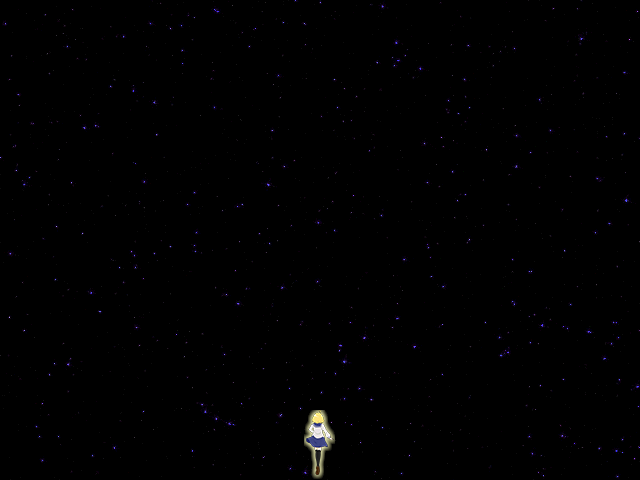
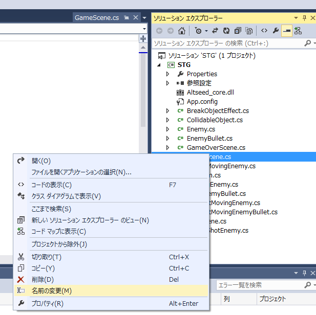
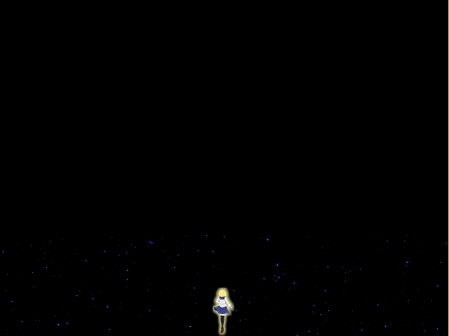
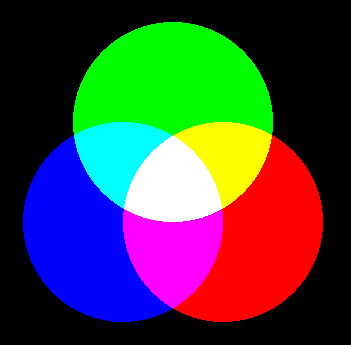
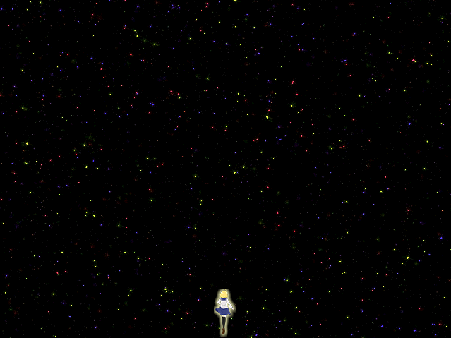

## 13. ゲーム画面の背景を実装してみよう

### 概要

「 [12. ゲームオーバー画面を実装してみよう](12.md) 」 では、ゲームを終了させることが可能になりました。  
これ以降の章では、よりゲームをゲームらしくするための要素を取り扱っていきます。

本章の目標は、背景をゲーム画面に表示させ縦スクロールさせることで自機が前へ動いているように見せかけることです。  
以下の手順を踏んで背景を実装していきます。

1. [背景画像の準備](#sec1)
2. [背景を表示する](#sec2)
3. [背景を実際に動かしてループさせる](#sec3)
4. [背景を加算描画する](#sec4)
4. [まとめ](#sec5)
6. [コード例](#sec6)

<a name="sec1"></a>
### 背景画像の準備 

そもそも、ゲーム画面の背景を実装する前に背景画像を用意する必要があります。用途に応じて条件を満たす背景画像を用意しなければなりません。今回は縦スクロールを想定しているので、以下の2点を満たしていれば背景画像としては十分でしょう。

* 縦にループができる
* 横の画像サイズがゲーム画面のサイズを超える。または、横にループができる

自分で用意しても差し支えありませんが、フリー素材を利用する手もあります。ただし、その場合は画像の権利等について、画像の著作者に従うようにしてください。

今回の講座で使う画像は予め`Resources`フォルダの中に含まれています。今開いている`STG.sln`と同じフォルダにある`bin`フォルダの中に`Resources`フォルダがあることを確認してください。

`Resources`内の背景画像の名前は以下の通りです。画像サイズはどれも 675×900 です。

* Game_Bg.png (青)
* Game_Bg_Aqua.png
* Game_Bg_AquaPlus.png
* Game_Bg_Green.png
* Game_Bg_Purple.png
* Game_Bg_Red.png
* Game_Bg_White.png
* Game_Bg_Yellow.png

<!-- 
* 背景テクスチャの使用宣言(pathが正しいか確認できるように)
* 背景テクスチャが満たすべき要件について説明（ループが自然、画面を覆う大きさを持っているか等…
 -->
<a name="sec2"></a>
### 背景を表示する 

まず、`asd.TextureObject2D` を継承した `Background` クラスを作りましょう。「 [06. 敵の表示](06.md) 」を参考にして、新しく `Background.cs` というソースコードを追加します。

#### MovingBackground クラスの設計

`Background` クラスを以下の通り実装します。今回はいくつか背景を変えたいので `Texture` に設定する画像のパス（ファイルの置かれている場所）もコンストラクタを通じて設定することにします。コード内にある `string` はC#でいう文字列です。分からない場合には[こちら]()を参照することをオススメします。

```cs
using System;
using System.Collections.Generic;
using System.Linq;
using System.Text;
using System.Threading.Tasks;

namespace STG
{
    public class Background : asd.TextureObject2D
    {
       public Background(asd.Vector2DF pos, string texturePath)
            : base()
        {
            // 初期位置を設定する。
            Position = pos;

            // texturePath で指定したパスにある画像を読み込んで Texture に変換します。
            Texture = asd.Engine.Graphics.CreateTexture2D(texturePath);
        }
    }
}
```

#### Background クラスを呼び出して、新しいレイヤーに背景を表示する

では、実際に `Background` クラスのコンストラクタを呼び出してみましょう。
以下のように `GameScene.cs` の `OnRegistered`の中に以下のようにコードを追加しましょう。

ここで注意点が2点あります。

* 背景用のレイヤー (backgroundLayer) を用意して `DrawingPriority` を低めに設定しておく。
* コンストラクタに渡す2番目の値は、画像のある場所を指すパスを設定うにする。

うまく実行できない場合はコンストラクタに渡す値の順番が間違ってないか確認しましょう。

```diff

        protected override void OnRegistered()
        {
            // 2Dを表示するレイヤーのインスタンスを生成する。
            asd.Layer2D layer = new asd.Layer2D();
+           asd.Layer2D backgroundLayer = new asd.Layer2D();

+           // レイヤーの描画優先度を設定する（デフォルトで0）
+           backgroundLayer.DrawingPriority = -10;

            // シーンにレイヤーを追加する。
            AddLayer(layer);
+           AddLayer(backgroundLayer);

+           // Background オブジェクトを生成する。ここで画像のパスを設定します。
+           Background bg1 = new Background(new asd.Vector2DF(0.0f, 0.0f), "Resources/Game_Bg.png");

+           // 背景をレイヤーに追加する。
+           backgroundLayer.AddObject(bg1);
            // プレイヤーのインスタンスを生成する。
            player = new Player();

            // プレイヤーのインスタンスをレイヤーに追加する。
            layer.AddObject(player);

            // レイヤーに反復して移動する敵のインスタンスを生成する。
            layer.AddObject(new VortexShotEnemy(new asd.Vector2DF(320.0f, 100.0f), player));
        }
```


これを実行してみると、以下の画像のような背景が表示されることがわかると思います。`backgroundLayer.Drawingpriority`を正の値に設定すれば自機や敵は背景で見えなくなります。実際に値を変えて実験してみると理解が深まると思います。



<a name="sec3"></a>
### 背景を実際に動かしてループさせる

表示された背景はまだ止まったままです。これを動かせばキャラクターが移動しているように見せることができます。では、以下の3点を実装したいと思います。

* 背景の動く速度を設定できるようにしたいので、 Background クラスのコンストラクタで`moveVelocity`を取得する。
* `Background` クラスのオブジェクトが `moveVelocity` を保持できるように、それを入れておく変数 `vel` を定義する。
* `Background` クラスに `OnUpdate()` を追加して、その中の処理で背景が動くようにする。

これを `Background.cs` に実装したコードは以下のようになります。

```diff
using System;
using System.Collections.Generic;
using System.Linq;
using System.Text;
using System.Threading.Tasks;

namespace STG
{
    public class Background : asd.TextureObject2D
    {
+       // vel という小数を定義しておく。
+       private float vel;
         
        // コンストラクタに渡す値に速度を追加する。
-       public Background(asd.Vector2DF pos, string texturePath)
+       public Background(asd.Vector2DF pos, string texturePath, float moveVelocity)
            : base()
        {
            // 初期位置を設定する。
            Position = pos;

            // texturePathで指定した場所にある画像を読み込み、設定する。
            Texture = asd.Engine.Graphics.CreateTexture2D(texturePath);

+           // moveVelocityを保持できるようにする。
+           vel = moveVelocity;
        }

+      protected override void OnUpdate()
+      {
+          // 毎回、Y座標をvelの値だけ位置を動かす。
+          Position += new asd.Vector2DF(0.0f, vel);
+      }
    }
}

```

また、コンストラクタに渡す値の数を変えたので、 `Program.cs` の `Background` クラスのコンストラクタを呼び出す文を書き換える必要があります。

```diff
            // Background オブジェクトを生成する。
-           Background bg1 = new Background(new asd.Vector2DF(0.0f, 0.0f), "Resources/Game_Bg.png");
+           Background bg1 = new Background(new asd.Vector2DF(0.0f, 0.0f), "Resources/Game_Bg.png", 1.0f);
```

背景を動かすことができるようになりました。ですので、`Background.cs` を `MovingBackground.cs` と名称を変えておきましょう。画像のように、Visual Studio の**ソリューションエクスプローラーー**
で名前の変更をしたいファイルを選び、右クリックして名前の変更を行うと、自動でクラス名なども変更してくれます。



この**名前の変更**は任意ですので、やる必要がないと感じた場合にはやらなくても問題ありません。

さて、実行してみるとわかりますが、以下の画像のように背景画像は1枚分しか流れません。これでは不完全なので、背景をループさせる必要があります。



#### 背景をループさせる

背景をループさせるにはどうしたらいいでしょう。現時点での問題点を挙げてみましょう。

* 背景画像が1枚分しか流れない。
* ループさせるには画像の上端と下端がぴったりくっつくように背景画像を流す必要がある。

上端と下端の話で察することができると思いますが、背景画像は少なくとも2枚ないとループさせることができません。
この発想をもとに背景をループさせる方法を考えてみましょう。

私なりに考えた方法は以下の通りです。余裕のある人は自分で考えてみてもいいかもしれません。

1. Background クラスの背景オブジェクトを2つ生成する。（このとき使う画像は同じ）
2. 最初は、(0.0f, 0.0f)と(0.0f, -Texture.Size.Y)に位置を設定して上端と下端がくっつくようにする。
3. 先に流れた背景オブジェクトのY座標がゲーム画面をはみ出たら、その位置を設定して上端と下端がくっつくようにする。

これでループ背景がつくれそうです。まずは、 `GameScene.cs` の`OnRegistered`から編集しましょう。

```diff
        protected override void OnRegistered()
        {
            // レイヤーを生成する。
            asd.Layer2D layer = new asd.Layer2D();
            asd.Layer2D backgroundLayer = new asd.Layer2D();

            // レイヤーの描画優先度を設定する（デフォルトで0）
            backgroundLayer.DrawingPriority = -10;

            // シーンにレイヤーを追加する。
            AddLayer(layer);
            AddLayer(backgroundLayer);

            // MovingBackground オブジェクトを生成する。
            MovingBackground bg1 = new MovingBackground(new asd.Vector2DF(0.0f, 0.0f), "Resources/Game_Bg.png", 1.0f);
+            // bg1 の上端に bg2 の下端をくっつける。
+            MovingBackground bg2 = new MovingBackground(new asd.Vector2DF(0.0f, -bg1.Texture.Size.Y), "Resources/Game_Bg.png", 1.0f);

            // 背景を背景レイヤーに追加する。
            backgroundLayer.AddObject(bg1);
+           backgroundLayer.AddObject(bg2);

```
新しく `MovingBackground` オブジェクトの `bg2` を生成しました。`bg2` 生成直前には `bg2.Texture` が用意されていないので `bg1.Texture` から画像の縦のサイズを取得することにします。

次は `MovingBackground.cs` の `MovingBackground` クラスにある `OnUpdate()` を編集しましょう。
```diff
protected override void OnUpdate()
       {
           // 毎回、Y座標をvelの値だけ位置を動かす。
           Position += new asd.Vector2DF(0.0f, vel);

+          // Y座標が画面外にはみ出たならば、
+          if (Position.Y >= asd.Engine.WindowSize.Y)
+          {
+              // Y座標から画像の縦2枚分の大きさを引く。
+              Position -= new asd.Vector2DF(0.0f, 2 * Texture.Size.Y);
+          }
       }
```
画面外にはみ出たら、また上端と下端がくっつくように画像を上に戻せばいいという考えを実装してみました。

編集が終わったら実行してみてください。これで背景がループできるようになりました。
<!-- 
* BackgroundクラスにOnUpdate()を実装して、PositionのY座標に定数を足していく
* 背景が切れるのでループできるようもう１つBackgroundクラスのオブジェクトを用意する
* 無限に背景を生成するのは頭悪い気がするのでTexture.Size.Yだけ動いたら-Texture.Size.Yに移動するようにする（次の背景が出るべき位置にOnUpdate()で画像を移動)
 -->
<a name="sec4"></a>
### 背景を加算合成する

次は背景を重ねてよりスケール感を出していきましょう。そのために加算合成をします。

#### 加算合成とは

赤、緑、青の色を加算合成で描画してみます。



画像を見て分かる通り、色を足すことで白へと近づいていきます。この加算合成によって光の重なりを表現することができます。

逆にどんな色も足されていない状態は黒です。画像に透過処理をしなくても黒で塗りつぶしておけば、加算合成の時に黒が塗られるのではなく、何もない色が足されます。つまり、透明になります。これを利用すると宇宙の表現が楽になります。

何を足し合わせているのか…というのは「光の三原色」「RGB値」で検索してみることをオススメします。

#### 背景をいくつか加算合成して描画する

背景画像の色違いパターンをいくつか用意しているので、それらを用いて加算合成をしてみましょう。

Altseed では、テクスチャの色を混ぜ合わせる方法として、 `TextureObject2D`クラス に `AlphaBlend` というプロパティが用意されています。`AlphaBlend`には以下のような設定ができます。

| AlphaBlend の状態 | 説明 |
|:-----------|:------------|
| ` asd.AlphaBlendMode.Blend ` | 画像の透明度（アルファ値）を用いて画像を描画します。　デフォルトの状態です。 |
| ` asd.AlphaBlendMode.Opacity ` | 透過処理を行わずに画像を描画します。 |
| ` asd.AlphaBlendMode.Add ` | 加算合成をして画像を描画します。 |
| ` asd.AlphaBlendMode.Sub ` | 減算合成をして画像を描画します。 |
| ` asd.AlphaBlendMode.Mul ` | 乗算合成をして画像を描画します。 |

**今回は加算合成をするので `asd.AlphaBlendMode.Add` を使用します。**

背景画像を宇宙と考えると、星は小さく見えるので、星そのものが光と考えてよさそうです。光の重なりを表現するのに加算合成はベストマッチです。

では、その実装について考えていきましょう。

宇宙のスケール感を出したいので、自機の近くにある背景は速く動き、遠くにある背景はゆっくり動かしてみたいと思います。
そして、色の選び方ですが、近くが眩しい色、遠くが鈍い色になるとそれらしくなるかと思います。

実装の手順は以下のようになるでしょう。

1. `MovingBackground` クラスで加算合成ができるように設定する。
2. `MovingBackground` クラスの背景オブジェクトが持つ `vel` の大きさに応じて、その背景オブジェクトが手前に描画されるか奧に描画されるかを設定する。
3. `GameScene.cs` の `OnRegistered` で 初期位置・色・速度 の違う背景をいくつか生成する。

まずは `MovingBackground.cs` の `MovingBackground` クラスのコンストラクタを編集します。
```diff
        public MovingBackground(asd.Vector2DF pos, string texturePath, float moveVelocity)
            : base()
        {
            // 初期位置を設定する。
            Position = pos;

            // texturePathで指定した場所にある画像を読み込み、設定する。
            Texture = asd.Engine.Graphics.CreateTexture2D(texturePath);

            // moveVelocityを保持できるようにする。
            vel = moveVelocity;

+           // Backgroundクラスのオブジェクトで加算合成ができるようにする
+           AlphaBlend = asd.AlphaBlendMode.Add;

+           // velの値に応じてDrawingPriorityを設定する
+           DrawingPriority = (int)( vel * 100 );
        }
```

次に `GameScene.cs` の `OnRegistered` を編集します。速度を新しく変更しています。

```cs

            // MovingBackground オブジェクトを生成する。
            MovingBackground bg1 = new MovingBackground(new asd.Vector2DF(0.0f, 0.0f), "Resources/Game_Bg.png", 0.3f);
            // bg1 の上端に bg2 の下端をくっつける。
            MovingBackground bg2 = new MovingBackground(new asd.Vector2DF(0.0f, -bg1.Texture.Size.Y), "Resources/Game_Bg.png", 0.3f);
            
            // 赤い背景を生成する。
            MovingBackground bgRed1 = new MovingBackground(new asd.Vector2DF(-2.0f, 30.0f), "Resources/Game_Bg_Red.png", 0.5f);
            MovingBackground bgRed2 = new MovingBackground(new asd.Vector2DF(-2.0f, 30.0f-bgRed1.Texture.Size.Y), "Resources/Game_Bg_Red.png", 0.5f);

            // 黄色い背景を生成する。
            MovingBackground bgYellow1 = new MovingBackground(new asd.Vector2DF(-10.0f, 80.0f), "Resources/Game_Bg_Yellow.png", 1.0f);
            MovingBackground bgYellow2 = new MovingBackground(new asd.Vector2DF(-10.0f, 80.0f - bgRed1.Texture.Size.Y), "Resources/Game_Bg_Yellow.png", 1.0f);

            // 背景を背景レイヤーに追加する。
            MovingBackgroundLayer.AddObject(bg1);
            MovingBackgroundLayer.AddObject(bg2);
            MovingBackgroundLayer.AddObject(bgRed1);
            MovingBackgroundLayer.AddObject(bgRed2); 
            MovingBackgroundLayer.AddObject(bgYellow1);
            MovingBackgroundLayer.AddObject(bgYellow2);
```

背景の初期位置をすべて (0.0f, 0.0f) にして実行してみるとわかると思いますが、最初だけ背景の点が重なるので若干気持ち悪いです。
適度にずらしてこれを回避しましょう。

実行してみると以下のように背景が重なりを持っているのが見えると思います。



<a name="sec5"></a>
### まとめ
今回は背景を実装してみました。これで画面をスクロールさせる基本ができたと思います。また、加算合成は背景に限らず、光の重なりの表現に応用できます。ぜひ色々な素材を用意して実験してみてください。

この章を完成した時点での、プロジェクトのサンプルはこちらになります。

[STG13.zip](Projects/STG13.zip?raw=true)


