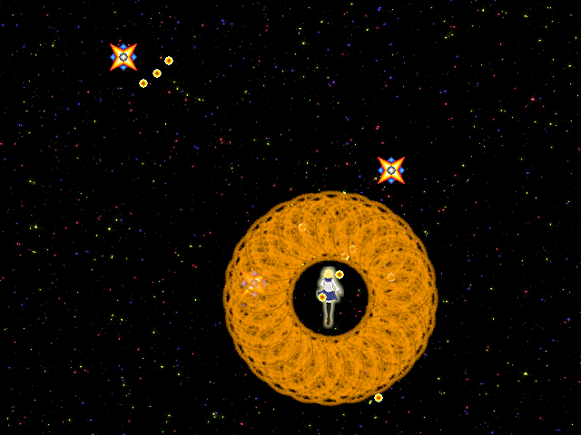
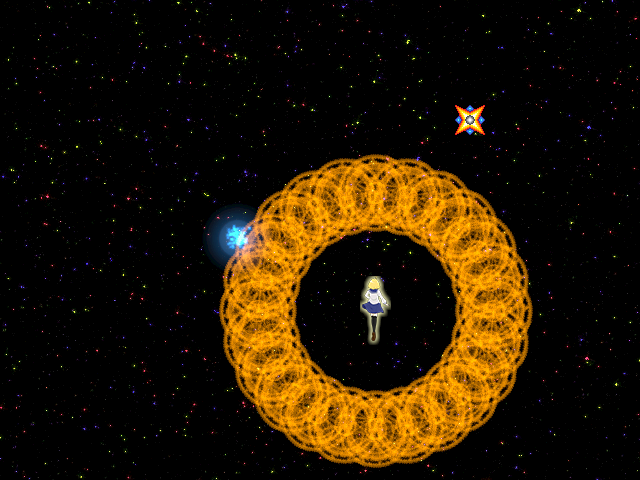

## 18. ボムを作ろう

### 概要

本章では、弾消し効果のあるボムを作っていきます。今回作るボムは、Xキーを押すことで発動し、敵の弾を消し、敵を破壊するたくさんの魔法陣を全方位に展開します。以下の手順でボムを実装していきます。

1. ボムクラスを作成する
2. Xキーでボムが発動するようにする
3. ボムと敵・敵弾の当たり判定をして、敵を倒せるようにする
4. 効果音を付ける。

### ボムが発動するようにする

今回作るボムは、たくさんの魔法陣を周りに発射するものです。そこで、１つ１つの魔法陣を「ボムクラス」に書いて、プレイヤーがXキーを押した時にボムクラスをたくさん生成するようにして作りましょう。まずは新しいファイル「Bomb.cs」を作成し、そこに以下のようにボムクラスを定義します。
ボムクラスはのちに敵や敵弾と当たり判定をするので、[９章](9.md)で登場した`CollidableObject`の機能を使うため、これを継承することにしましょう。

```cs
namespace STG
{
	// ボムの魔法陣１つを表すクラス。
	class Bomb : CollidableObject
	{
		// 魔法陣の移動速度
		asd.Vector2DF velocity;

		// 時間を数えるカウンタ
		int count;
		
		public Bomb(asd.Vector2DF position, float angle)
		{
			// 初期位置を設定
			Position = position;

			// 魔法陣の画像を読み込み
			Texture = asd.Engine.Graphics.CreateTexture2D("Resources/Circuit.png");

			// 描画原点を画像の中心に設定
			CenterPosition = new asd.Vector2DF(Texture.Size.X / 2, Texture.Size.Y / 2);

			// 移動速度を設定
			velocity = new asd.Vector2DF(1, 0);
			velocity.Length = 2.0f;		// 速度を設定
			velocity.Degree = angle;    // 角度を設定

			count = 0;
		}

		protected override void OnUpdate()
		{
			// 速度ベクトルの分だけ移動させる
			Position += velocity;

			// 画像を回転する
			Angle += 5;

			// 時間を数える
			count++;

			// 120フレーム経っていたら消える
			if (count >= 120)
			{
				Dispose();
			}
		}
	}
}
```

このコードについて解説します。コンストラクタでは、自機の弾と同様に初期位置を引数にとっています。また、全方位に魔法陣を発射するために、魔法陣の動く向きをカスタマイズできるようにしたいので、魔法陣の動く向き（度数法の角度）を引数にとっています。そして、画像と初期位置、描画原点を設定した後、引数にとった向きの値を元に速度ベクトルを計算し、保持します。

実際に魔法陣を移動させるのは`OnUpdate`関数の中です。敵弾などと同じように、速度ベクトルを現在位置に加算することで位置を動かします。また、少し見た目を華やかにするために魔法陣を回転させます。そして、`count`変数を使ってフレーム数を数え、120フレームに達したらオブジェクトを削除するようにしています。以上がボムクラスで行っていることです。

ボムクラスができたので、実際にこれを発射する部分を作りましょう。プレイヤーがXキーを押した時に発射するので、`Player`クラスの`OnUpdate`メソッドに処理を追加しましょう。

```diff
protected override void OnUpdate()
{
	(省略)

    // もし、Zキーを押したら{}内の処理を行う。
    if(ace.Engine.Keyboard.GetKeyState(ace.Keys.Z) == ace.KeyState.Push)
    {
        // 弾を生成する。
        Bullet bullet = new Bullet(Position + new ace.Vector2DF(0, -6));

        // 弾をレイヤーに追加する。
        Layer.AddObject(bullet);
    }

+   // Xキーを押したら
+   if (asd.Engine.Keyboard.GetKeyState(asd.Keys.X) == asd.KeyState.Push)
+   {
+   	for (int i = 0; i < 24; i++)
+   	{
+   		// ボムを生成
+   		Bomb bomb = new Bomb(Position, 360 / 24 * i);
+
+   		// ボム オブジェクトをエンジンに追加
+   		asd.Engine.AddObject2D(bomb);
+   	}
+   }

    (省略)
}
```

コードでは、ショットを打つ時と同様に、Xキーを押した時に魔法陣を発射する処理を追加しました。if文でXキーを押したかどうかを判定し、if文のブロックの中ではfor文を用いて24個の魔法陣を生成するようにしています。ボムの向きとして引数に渡している`360 / 24 * i`とは、「１周の角度 / 24個 * 繰り返しの何回目か」という意味で、こうすることによって一周に24個の魔法陣を発射することができます。

コードを書いたら実行してみましょう。Xキーを押すことでボムが発動するようになったと思います。ただし、敵や敵弾に当てても相手を破壊することはまだできません。



### 敵や敵弾を消せるようにする

次に、敵や敵弾を破壊する機能をこのボムに実装しましょう。ボムの魔法陣と敵との当たり判定をとり、当たっていたら敵を消滅させる、というのが処理の流れになります。

当たり判定は毎フレーム実行する必要がありますので、そのプログラムは`OnUpdate`内に書きましょう。
次のようにコードを追加してください。ただし、ここまででは実行しても何も変わりません。

```diff
// ボムの魔法陣１つを表すクラス。
class Bomb : CollidableObject
{
	// 魔法陣の移動速度
	asd.Vector2DF velocity;

	// 時間を数えるカウンタ
	int count;

	public Bomb(asd.Vector2DF position, float angle)
	{
		// 初期位置を設定
		Position = position;

		// 魔法陣の画像を読み込み
		Texture = asd.Engine.Graphics.CreateTexture2D("Resources/Circuit.png");

		// 描画原点を画像の中心に設定
		CenterPosition = new asd.Vector2DF(Texture.Size.X / 2, Texture.Size.Y / 2);

		// 移動速度を設定
		velocity = new asd.Vector2DF(1, 0);
		velocity.Length = 2.0f;     // 速度を設定
		velocity.Degree = angle;    // 角度を設定

		count = 0;

+   	// 半径をテクスチャサイズの半分に設定
+   	Radius = Texture.Size.X / 2;
	}

	protected override void OnUpdate()
	{
		// 速度ベクトルの分だけ移動させる
		Position += velocity;

		// 画像を回転する
		Angle += 5;

		// 時間を数える
		count++;

		// 120フレーム経っていたら消える
		if (count >= 120)
		{
			Dispose();
		}

+		// レイヤー内のオブジェクトと当たり判定をする
+		foreach (var item in Layer.Objects)
+		{
+			CollideWith(item as CollidableObject);
+		}
	}
	
+   // 指定したオブジェクトと当たり判定をするメソッド
+   private void CollideWith(CollidableObject obj)
+   {
+   }
}
```

まだ空の`CollideWith`というメソッドを追加しました。このようにした理由は、Enemyクラスで同じようにしたというのもありますが、OnUpdate内には回転や移動、時間による消滅の処理がすでに書かれていて、ここに敵や敵弾との当たり判定処理が混ざってしまうとパッと見た時にどこからどこまでが当たり判定処理なのかが分かりにくくなるからです。メソッドにくくり出して名前をつけることで、その部分でどんな処理をしているのかがパッと見てわかりやすくなります。いろいろな処理を１つのメソッドに書くことになったときは、このように意味のある単位で別のメソッドとしてくくりだし、適切な名前をつけることを検討してみてください。

次に、`CollideWith`メソッドの中身を作り、ボムと敵や敵弾との当たり判定を実装しましょう。次のようにコードを追加します。

```diff
// ボムの魔法陣１つを表すクラス。
class Bomb : CollidableObject
{
    (省略)

	// 指定したオブジェクトと当たり判定をするメソッド
	private void CollideWith(CollidableObject obj)
+   {
+   	// オブジェクトがnullか、消滅していたら当たり判定をしない
+   	if (obj == null || !obj.IsAlive)
+   	{
+   		return;
+   	}
+
+   	if (obj is Enemy)	// オブジェクトがEnemyだった場合
+   	{
+   		if (IsCollide(obj))
+   		{
+   			obj.OnCollide(this);
+   		}
+   	}
+   	else if (obj is EnemyBullet)	// オブジェクトがEnemyBulletだった場合
+   	{
+   		if (IsCollide(obj))
+   		{
+   			obj.OnCollide(this);
+   		}
+   	}
	}
}
```

このメソッドの中では[第９章](9.md)の`Enemy`の`CollideWith`メソッドとほとんど同じことをしています。引数に渡された`CollidableObject`が`Enemy`や`EnemyBullet`かどうかを判定し、その場合にその相手と当たり判定をします。
ここでは`is`という演算子が使われています。この演算子は、左辺のインスタンスが右辺の型（またはそこから派生した型）の変数かどうかを判定する演算子です。これを使うことで、インスタンスの種類を判定することができます。

敵クラスの`OnCollide`メソッド、敵弾クラスの`OnCollide`メソッドは自身を消滅させる処理をしているので、ここまでの記述でボムの魔法陣が敵や敵弾を破壊することができます。実際に実行して確かめてみてください。



### 効果音を付ける

最後に、ボムを発射した瞬間に効果音を付けましょう。`Player`クラスに以下のようにコードを追加します。

```diff
public class Player : CollidableObject
{
	// ショットの効果音。
	private asd.SoundSource shotSound;

	// 破壊されたときの効果音。
	private asd.SoundSource deathSound;

+   // ボムを発動した時の効果音。
+   private asd.SoundSource bombSound;

	public Player()
	{
		// 画像を読み込み、プレイヤーのインスタンスに画像を設定する。
		Texture = asd.Engine.Graphics.CreateTexture2D("Resources/Player.png");

		// プレイヤーのインスタンスに画像の中心位置を設定する。
		CenterPosition = new asd.Vector2DF(Texture.Size.X / 2.0f, Texture.Size.Y / 2.0f);

		// プレイヤーのインスタンスの位置を設定する。
		Position = new asd.Vector2DF(320, 480);

		// プレイヤーの Radius は小さめにしておく
		Radius = Texture.Size.X / 8.0f;
		
		// ショットの効果音を読み込む。
		shotSound = asd.Engine.Sound.CreateSoundSource("Resources/Shot.wav", true);

		// 破壊されたときの効果音を読み込む。
		deathSound = asd.Engine.Sound.CreateSoundSource("Resources/Explode.wav", true);

+   	// ボムを発動したときの効果音を読み込む。
+   	bombSound = asd.Engine.Sound.CreateSoundSource("Resources/Bomb.wav", true);
	}


	protected override void OnUpdate()
	{
		(省略)

		// Xキーを押したら
		if (asd.Engine.Keyboard.GetKeyState(asd.Keys.X) == asd.KeyState.Push)
		{
			for (int i = 0; i < 24; i++)
			{
				// ボムを生成
				Bomb bomb = new Bomb(Position, 360 / 24 * i);

				// ボム オブジェクトをエンジンに追加
				asd.Engine.AddObject2D(bomb);
			}

+   		asd.Engine.Sound.Play(bombSound);
		}

		// プレイヤーの位置を取得する。
		asd.Vector2DF position = Position;

		// プレイヤーの位置を、(テクスチャの大きさ/2)～(ウインドウの大きさ-テクスチャの大きさ/2)の範囲に制限する。
		position.X = asd.MathHelper.Clamp(position.X, asd.Engine.WindowSize.X - Texture.Size.X / 2.0f, Texture.Size.X / 2.0f);
		position.Y = asd.MathHelper.Clamp(position.Y, asd.Engine.WindowSize.Y - Texture.Size.Y / 2.0f, Texture.Size.Y / 2.0f);

		// プレイヤーの位置を設定する。
		Position = position;
	}
}
```

コンストラクタ内でメンバ変数に音をロードし、Xキーでボムが発動するときに音を鳴らしています。ロードの際、`CreateSoundSource`の第２引数に渡す値は効果音の場合`true`であることに注意してください。効果音を鳴らすタイミングをボムクラスのコンストラクタではなくプレイヤークラスのXキーを押した場合の処理に書いたのは、ボムが24回生成されるせいで効果音が24回再生されてしまうのを防ぐためです。

### まとめ

今回はボムを作成しました。また、メソッドでプログラムの一部分をくくりだすことでコードを整理する考え方についても解説しました。

最後に、本章を最後まで終わらせた時のプロジェクトをダウンロードできるようにしておきました。

[プロジェクト(Windows)](Projects/STG18.zip?raw=true)