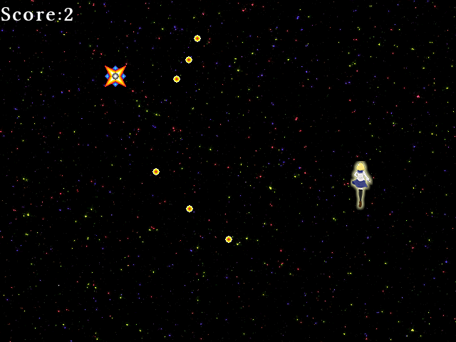

## 19. スコア機能を付けて画面に表示してみよう

### 概要

前回までの内容で、ゲームは殆ど完成です。
しかし、敵を倒してもスコアが増えません。
そこで今回はスコアを実装して画面にスコアを表示するようにしてみましょう。

### フォントファイルの読み込み

Altseed を利用して画面に文字を表示するには、まず「描画するための書体（フォント）」をエンジンに読み込ませなければなりません。

Altseedでフォントフォントファイルを読み込むために以下のソースコードを追加します。

```diff
+   asd.Font font = asd.Engine.Graphics.CreateFont("");
```

ここで読み込んでいるのはaffというAltseed独自のフォントファイルです。このファイルはAltseedに用意されている「フォントファイルジェネレーター」を使用して
Windows等にインストールされているフォントから生成されます。今回は予めファイルを用意してありますので、それを使用します。

### 文字の表示

フォントファイルを読み込んだだけでは文字は表示されません。文字を表示するためには、`asd.TextObject2D`というクラスを使用します。
これは`asd.TextureObject2D`の画像でなく文字を表示するバージョンです。

以下のコードは使い方の一例です。

```diff
    asd.Font font = asd.Engine.Graphics.CreateFont("Resources/Font.aff");

+   asd.TextObject2D textObj = new asd.TextObject2D();
+   textObj.Font = font;
+   textObj.Text = "Score:";
+   asd.Engine.AddObject(textObj);
```

`asd.TextObject2D.Font` は描画に使用するフォント、`asd.TextObject2D.Text` は描画される文字です。

座標を指定していないので当然ですが、画面の左上に表示されました。


それでは、`asd.TextObject2D`を用いてスコアを表示します。

### スコアの表示

では、実際にスコアを画面上に表示させてみましょう。

GameScene.csのGameSceneクラスにスコアを保存する変数を追加します。

```diff
// ゲームの経過時間を管理
int count;

+// スコアを管理
+public int Score = 0;
```

他のクラスから読み書きするためにpublicにします。

次に、敵が倒された時にスコアを加算するようにします。Enemy.csのEnemyクラスのOnCollideに点数を加算する処理を追加します。


```diff
public override void OnCollide(CollidableObject obj)
{
	// このインスタンスと同じ位置にエフェクトインスタンスを生成して、エンジンに追加する。
	Layer.AddObject(new BreakObjectEffect(Position));
	asd.Engine.Sound.Play(deathSound);
	Dispose();

+	// スコアを加算
+	var scene = (GameScene)Layer.Scene;
+	scene.Score += 1;
}

```

```diff
// HPが0以下ならば
if (HP <= 0)
{
    // Bossを消去する
    Dispose();

+	// スコアを加算
+	var scene = (GameScene)Layer.Scene;
+	scene.Score += 5;
}
```

シーンを取得し、GameSceneクラスにキャストしてスコアを加算しています。

最後にスコアを表示します。

スコアを表示するために、UIレイヤーを追加します。

まず、GameSceneクラスのメンバー変数にUIレイヤーの変数を宣言します。

```diff
// 敵の出現するレイヤーを持つ
asd.Layer2D gameLayer;

+// UIを表示するレイヤーを持つ
+asd.Layer2D uiLayer;

```

次にレイヤーを生成して追加します。

```diff
    // レイヤーを生成する。
    gameLayer = new asd.Layer2D();
    asd.Layer2D backgroundLayer = new asd.Layer2D();
+   uiLayer = new asd.Layer2D();
```

```diff
    // シーンにレイヤーを追加する。
    AddLayer(gameLayer);
    AddLayer(backgroundLayer);
+   AddLayer(uiLayer);
```

これだけではスコアを表示できないのでスコアを表示するクラスを定義します。

Score.csを追加し、以下のコードを記述します。

```cs
class Score : asd.TextObject2D
{
	public Score()
	{
		asd.Font font = asd.Engine.Graphics.CreateFont("Resources/Font.aff");
		Font = font;
	}

	protected override void OnUpdate()
	{
		var scene = (GameScene)Layer.Scene;
		Text = "Score : " + scene.Score.ToString();
	}
}
```

```diff
    // レイヤーにプレイヤーのインスタンスを追加する。
    gameLayer.AddObject(player);

+   // レイヤーにスコアのインスタンスを追加する。
+   var score = new Score();
+   uiLayer.AddObject(score);
```

敵を倒すとスコアが増加して、そのスコアが画面に表示されるようになりました。



### フォントファイル作成ツールを利用してみよう

自分の好きなフォントをAltseed上で利用するには、Altseedに用意されている「フォントファイルジェネレーター」を使用して、
フォントファイルをAltseedが利用できる形式に変換する必要があります。

それを行うために、Altseedではフォントファイルジェネレーターというツールを使用します。

今回はフォントファイルジェネレーターを以下のリンクからダウンロードします。

[フォントジェネレーター](Common/FontGenerator.zip?raw=true)

ダウンロードは終わりましたか？それでは、ダウンロードされた圧縮ファイルを解凍しましょう。
解凍したら、FontGenerator.WPF.exe という実行ファイルを探しましょう。

見つけたら、FontGenerator.WPF.exeを起動してみましょう。起動すると、以下の画面が表示されます。


様々な設定項目があり、これでフォントや文字の色、文字の縁取り等を調節できます。

MacやLinuxの場合は、　CUI画面からMonoコマンドを使用してCUI版のFontgeneratorを用いることで、フォントファイルを生成することができます。

```
$ mono ./FontGenerator.exe
使用するフォントファイルを指定してください。
> rounded-mplus-1c-light.ttf

使用するテキストファイルのパスを指定してください。
> test.txt

出力先のファイル名(拡張子除く)を指定してください。
> test_mplus

フォントサイズを指定してください。
> 15

画像のサイズを指定してください。
> 1024

フォントの色を指定してください[0-255]
  Red> 0
Green> 100
 Blue> 200
Alpha> 255

フォント生成中…
生成しました。

```

### 動的フォントを利用してみよう

AltseedではOSにインストールされているフォントを使用することもできます。

以下のコードではMSゴシックを使用しています。


```diff
    asd.Font font = asd.Engine.Graphics.CreateDynamicFont("MS Gothic", 24, new asd.Color(0, 0, 0, 255), 1, new asd.Color(255, 255, 255, 255));

+   asd.TextObject2D textObj = new asd.TextObject2D();
+   textObj.Font = font;
+   textObj.Text = "サンプル";
+   asd.Engine.AddObject(textObj);
```

フォント名にフォントファイルを指定するとフォントファイルからフォントを生成します。
また、空欄にした場合、OSのデフォルトのフォントが使用されます。

### まとめ

今回はスコアを表示しました。これでゲーム本体の講座は終わりです。次からは配布や品質の向上に関することを説明します。

最後に、本章を最後まで終わらせた時のプロジェクトをダウンロードできるようにしておきました。

[プロジェクト(Windows)](Projects/STG19.zip?raw=true)