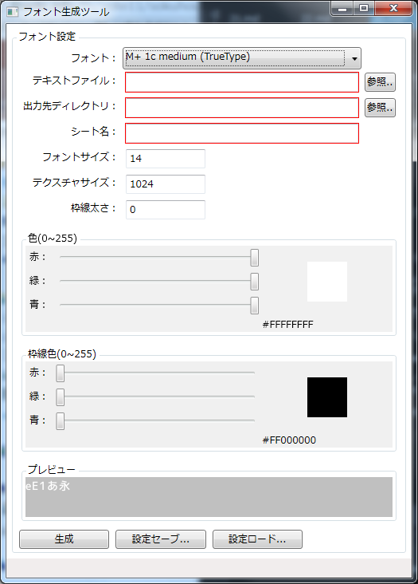

## 19. スコア機能を付けて画面に表示してみよう

### 概要

前回までの内容で、ゲームは殆ど完成です。
しかし、敵を倒してもスコアが増えません。
そこで今回はスコアを実装して画面にスコアを表示するようにしてみましょう。

### フォントファイルの読み込み

Altseed を利用して画面に文字を表示するには、まず「描画するための書体（フォント）」をエンジンに読み込ませなければなりません。

Altseedでフォントフォントファイルを読み込むために以下のソースコードを追加します。

```
+asd.Font font = ace.Engine.Graphics.CreateFont("");
```

ここで読み込んでいるのはaffというAltseed独自のフォントファイルです。このファイルはAltseedに用意されている「フォントファイルジェネレーター」を使用して
Windows等にインストールされているフォントから生成されます。今回は予めファイルを用意してありますので、それを使用します。

### 文字の表示

フォントファイルを読み込んだだけでは文字は表示されません。文字を表示するためには、`asd.TextObject2D`というクラスを使用します。
これは`asd.TextureObject2D`の画像でなく文字を表示するバージョンです。

以下のコードは使い方の一例です。

```
asd.Font font = asd.Engine.Graphics.CreateFont("フォントファイル");

+asd.TextObject2D textObj = new asd.TextObject2D();
+textObj.Font = font;
+textObj.Text = "サンプル";
+asd.Engine.AddObject(textObj);
```

`asd.TextObject2D.Font` は描画に使用するフォント、`asd.TextObject2D.Text` は描画される文字です。

座標を指定していないので当然ですが、画面の左上に表示されました。


それでは、`asd.TextObject2D`を用いてスコアを表示します。

### スコアの表示

では、実際にスコアを画面上に表示させてみましょう。

Game.csにスコアを保存する変数を追加します。

```
public int Score = 0;
```

他のクラスから読み書きするためにpublicにします。

次に、敵が倒された時にスコアを加算するようにします。

```
var scene = (Game)Scene;
scene.Score += 1;
```

シーンを取得し、Gameクラスにキャストしてスコアを加算します。

最後にスコアを表示します。

```
```

### フォントファイル作成ツールを利用してみよう

自分の好きなフォントをAltseed上で利用するには、Altseedに用意されている「フォントファイルジェネレーター」を使用して、
フォントファイルをAltseedが利用できる形式に変換する必要があります。

それを行うために、Altseedではフォントファイルジェネレーターというツールを使用します。

今回はフォントファイルジェネレーターを以下のリンクからダウンロードします。

[フォントジェネレーター](Common/FontGenerator.zip?raw=true)

ダウンロードは終わりましたか？それでは、ダウンロードされた圧縮ファイルを解凍しましょう。
解凍したら、FontGenerator.WPF.exe という実行ファイルを探しましょう。

見つけたら、FontGenerator.WPF.exeを起動してみましょう。起動すると、以下の画面が表示されます。



様々な設定項目があり、これでフォントや文字の色、文字の縁取り等を調節できます。


