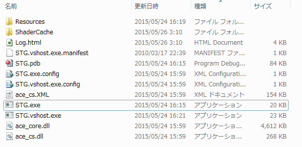
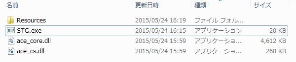

## 21. 公開の準備を整えよう

### 概要

さて、前回までの内容でゲーム本体がめでたく「完成」しました。折角ゲームを作ったのですから、「公開」して他の人に遊んでもらいましょう。
今回は、実際に作ったゲームを「公開」するための準備について解説していきます。

### ファイルパック

まず、現状では画像・音楽などの各種のファイルが外から見えるようになってしまいます。これでは、ゲームをプレイした人に悪意があった場合、素材などをそのままの形で持っていかれてしまう可能性があり、危険です。
そこで、AC-Engineの提供するファイルパックのためのツールを用いて、これらのファイルが外から直接見えないように（なおかつ、ゲーム本体からは正しく参照できるように）してみましょう。

### Releaseビルド

現在は、プロジェクトのビルドの際に「Debugビルド」を使用しています。
Debugモードはデバッグ情報を含んでビルドするため、バグの発生時に原因の特定などが非常に容易になっている反面、そのために含まれているデバッグ情報が容量を多くとってしまうという問題があります。
また、Debugモードでは最適化（プログラムが最も高速に動作するようにするための処理）が行われないため、開発に使用しているマシンの性能などによってはプログラムの実行が若干重く感じるかも知れません。

そこで、デバッグ情報を除くことで軽量化し、また最適化（高速化）を行うために、プロジェクトのビルドの際に「Releaseビルド」を使用するようにしてみましょう。
「Debugビルド」から「Releaseビルド」への変更は、Visual Studioのウインドウの下記の場所で行えます。「開始」の右側に「Debug」と書かれているプルダウンメニューがありますので、▼を押して出てくる「Release」を選択しましょう。

ここまでの操作を行ったら、F5キーを押して再度ビルドしてみましょう。Releaseビルドで作成したexeファイルは、今までと同じbinフォルダの中に生成されますので、特別な操作をする必要はありません。
これで、Releaseビルドは完了です。

### 公開時に消していいファイル、消してはいけないファイル

さて、公開のために、exeファイルの入っているbinフォルダを見てみましょう。ここまでの操作を講座通りにこなしている場合、binフォルダの中身は次のようになっていると思います。

この中には以下の「公開時には不要なファイル・フォルダ」が混ざっています。それらを削除してみましょう。

- ShaderCache フォルダ
- Log.html
- STG.vshost.exe.manifest
- STG.pdb
- STG.exe.config
- STG.vshost.exe.config
- ace_cs.XML
- STG.vshost.exe

「こんなに削除していいの？」と思う方もいらっしゃるかもしれませんが、もちろん大丈夫です。逆に、以下のファイル・フォルダは絶対に消さないでください。

- Resources フォルダ
- STG.exe
- ace_core.dll
- ace_cs.dll

もちろん、exeファイルを削除してしまっては何も出来なくなってしまいますね。不要なファイルが含まれている分には多少不恰好になるだけで大きな問題は起きないのですが、必要なファイルを削除してしまった場合、ゲームをプレイしてくれる人の環境で動かなくなってしまうということが十分に有り得ます。注意しましょう。

ここまでの操作で、binフォルダは以下のようになるはずです。

公開に必要なのは、binフォルダの中身だけです。新しいフォルダを適当に作り、その中にbinフォルダの中身をコピーしてやれば、作品を配布する準備は粗方整ったと言ってよいでしょう。
後は、取扱説明書を用意したり、binフォルダの名前を適切に変更した後zipファイルに圧縮したりすれば、無事に「公開用データ」の完成です。
ace
### ライセンス等に注意！

ゲーム中に使用するグラフィック・効果音・BGM・フォントや各種のライブラリ等について、「全て自分で作りました！」という場合は問題ないのですが、恐らく殆どの方は何らかの「素材」を利用していることかと思います。
各種の素材は非常に便利な反面、利用に当たり様々な規約・制約が設けられているものも多く、公開前に今一度それらについて確認しておく必要があります。「素材を加工して利用してはいけない」「利用した場合は必ずクレジットを記載する」「商用利用は別途有料ライセンスが必要」など様々な種類の規約があり、場合によっては重大なトラブルを引き起こす可能性もありますので、素材を利用する際は予め規約に目を通しておくようにすると良いでしょう。

### 「本当に起動できますか？」

配布する前に、公開する予定のファイルをもう１度起動してみましょう。「ファイルが見つかりません」等のエラーで落ちていませんか？それとも、他の要因などで落ちていませんか？
今までの開発段階では起動していたにも関わらず「zipに固めたものを再度解凍してみたら遊べなくなっていた」という場合は、十中八九「必要なファイルまで消してしまっている」場合がほとんどです。当然このままではデータを受け取った人もゲームをプレイすることはできませんから、公開前に今一度必要なファイルがそろっているかどうかよく確認してみてください。
もちろん、AC-Engineを利用した作品を配布する際は「プレイする側のPCに最新版のDirectX及び.NET Frameworkがインストール」されている状態でないといけませんから、取扱説明書などにその記述を入れておくと良いでしょう。

さて、ここまでの段階で、めでたく皆さんの「作品」は完成です。次章からは、その「作品」を更に良くするためのTipsを取り扱っていきます。