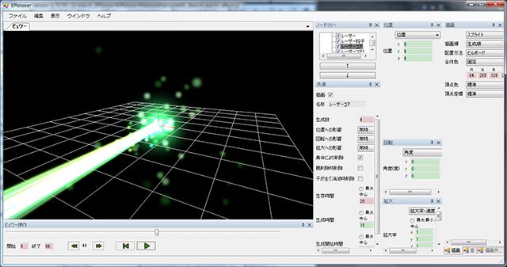
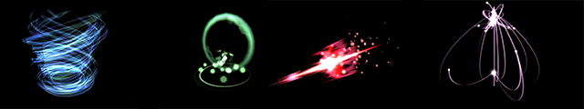
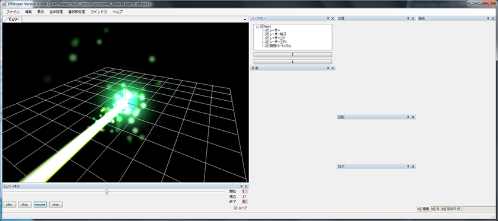
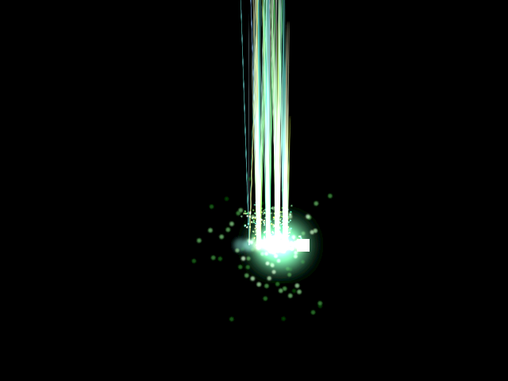
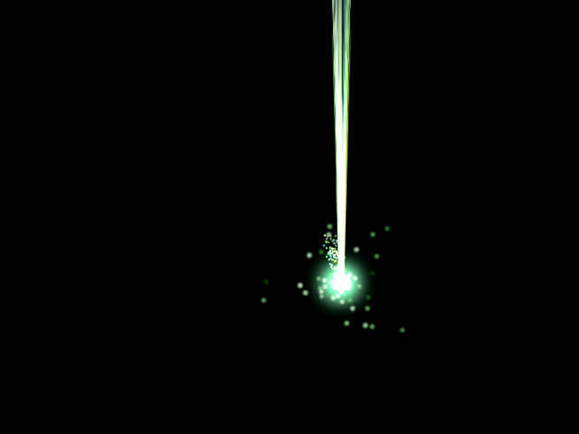

## 22. Tips : エフェクトを導入してみよう

### 概要

いままでは、キャラクターも弾も画像を用いて描画していました。当然、弾を撃った時に発生するエフェクトや弾が命中した時に発生するエフェクトも画像を用いて描画できます。


その画像を複数枚用意することにより、アニメーションも表現できます。ただ、複数枚の画像を用いてエフェクトを表現する場合、画像のサイズが大きくなってしまいます。
それを防ぎ、かつ、効率よくエフェクトを作成するためにAC-EngineではEffekseerというエフェクト編集ツール上で生成されたエフェクトのデータを直接再生できるようになっています。



この、Effekseerというツールは数値と画像を元に様々なエフェクトを作成できます。例えば、ヒットエフェクト、弾から必殺技まで全て作成できます。



本章では、AC-Engine上でEffekseerにより作成されたエフェクトを表示する方法を説明します。

### 事前準備

今回も、自分でプロジェクトの設定せずに、設定済みのプロジェクトをダウンロードして、それを使用します。

なお、今回はTipsにつき、前章までのソースコードとは関連がありません。リソースもプロジェクトに含まれています。

[プロジェクト](Projects/STG22.zip)

[DLL](Common/dll.zip)

### エフェクトの作成

まず、Effekseerの公式サイトからツールをダウンロードしましょう。

このサイトから　Effekseer0.620 (2015/05/23時点での最新版) をダウンロードします。

[Effekseer公式サイト](https://sites.google.com/site/effekseer/)

ダウンロードされたファイルには編集ツールやサンプルが付属しています。
それではダウンロードされたファイルを解凍して、``` Bin/Effekseer.exe ``` を起動します。そして、``` Sample/00_Basic/Laser01.efkproj ``` といったサンプルファイルを開いてみましょう。
開いて再生ボタンを押すと以下のような画面が表示されます。



今回の目的はエフェクトの編集の仕方を教えることではないので、開いているファイルをAC-Engineで読み込める形式に変換します。

``` ファイル->出力->標準形式 ``` の順番にメニューを選択していくと、標準形式(.efk)ファイルを出力できます。
保存するときに倍率を聞かれますが、ここでは1を選択します。

### エフェクトの表示

ここでは、先ほど保存したエフェクトをAC-Engine上で動作させる方法を説明します。

わかりやすくするために、何かしら方向キーを押すと移動して、Zキーを押すと弾を発射するプレイヤーを用意します。特にソースコードは提示しませんが、いままでこの講座を
読んできた人なら問題なく用意できるでしょう。

エフェクトを表示するためには、```ace.TextureObject2D``` ではなく、 ``` ace.EffectObject2D ``` を使用します。
これは読み込んだエフェクトファイルからエフェクトを表示するクラスです。エフェクトファイルを読み込むにはテクスチャの読み込みと同じような、``` ace.Engine.Graphics.CreateEffect ```
というメソッドを用います。

今回はエフェクトがレーザーのため、``` ace.EffectObject2D ```を継承してレーザークラスを用意しました。

```
class Laser : ace.EffectObject2D
{
	public Laser()
	{
		Effect = ace.Engine.Graphics.CreateEffect("effect.efk");
	}
}
```

次に、このクラスを用いてレーザーのエフェクトを表示します。

レーザーを発車する前に、レーザーをプレイヤークラスのメンバ変数として保存するようにします。レーザーも弾と同じようにレーザー自身がレーザーが見えなくなったら
レーザーを消せばいいのだからメンバ変数に保存する必要はないと思う人もいるかもしれませんが、レーザーはプレイヤーと一緒に動くため、発射した後も一緒に移動させる必要があります。
そのため、メンバ変数に追加します。

プレイヤークラスのメンバ変数にレーザーを追加します。

```
Laser laser = null;
```


プレイヤークラスのインスタンスがレイヤーに追加されたら、レーザーもレイヤーに追加されるようにします。
```
protected override void OnStart()
{
	laser = new Laser();
	Layer.AddObject(laser);
}
```

プレイヤーが更新される度にレーザーの位置も一致するようにします。

```
protected override void OnUpdate()
	{
		// レーザーの位置を同期する。
		laser.Position = Position;

		～省略
```

そして、Zキーを押した時の挙動を記述します。

```
// もし、Zキーを押したら{}内の処理を行う。
if (ace.Engine.Keyboard.GetKeyState(ace.Keys.Z) == ace.KeyState.Push)
{
	// レーザーのエフェクトを再生する。
	laser.Play();
}
```

それでは実行してみましょう。・・・しかし何も見えません。これはエフェクトの大きさが小さすぎるからです。


それでは、エフェクトの拡大率を変更してみます。

```diff
// もし、Zキーを押したら{}内の処理を行う。
if (ace.Engine.Keyboard.GetKeyState(ace.Keys.Z) == ace.KeyState.Push)
{
+	// エフェクトの拡大率を設定する。
+	laser.Scale = new ace.Vector2DF(10, 10);

	// レーザーのエフェクトを再生する。
	laser.Play();
}
```

今度はエフェクトは出ましたがレーザーの形状をしていません。これは、エフェクトの回転が設定されておらず正面から見ているのが原因です。


それでは、エフェクトを回転させてみます。ただ、提示されるソースコードでは2Dなのに回転方向を2つ指定しています。これは、3Dで作成されたエフェクトを2Dに表示するためです。
回転軸が1つではエフェクトを任意の方向に回転させられません。その回転軸は以下のようになります。

Angleは画面の正面方向を軸に半時計回り、EffectRotationは画面の上方向を軸に時計回りです。 


レーザーが向かう方向が上になるよう回転させたソースコードに変更します。

```diff
// もし、Zキーを押したら{}内の処理を行う。
if (ace.Engine.Keyboard.GetKeyState(ace.Keys.Z) == ace.KeyState.Push)
{
+	// エフェクトの角度を設定する。
+	laser.EffectRotation = 90;
+	laser.Angle = -90;
				
	// エフェクトの拡大率を設定する。
	laser.Scale = new ace.Vector2DF(10, 10);

	// レーザーのエフェクトを再生する。
	laser.Play();
}
```

レーザーが表示されました。しかし、レーザーはプレイヤーの位置に同期しておらず、生成した位置に留まったままです。
これは同期するための設定をしていないのが原因です。




それでは、同期する設定をします。ace.EffectObject2Dはエフェクト自体ではなく、エフェクトを表示する発射台のようなものです。そのため、何も設定しないと
発射台が移動しても、発射後のエフェクトは追従してくれません。追従するようにするには、``` SyncEffects ``` をtrueにします。

```diff
// もし、Zキーを押したら{}内の処理を行う。
if (ace.Engine.Keyboard.GetKeyState(ace.Keys.Z) == ace.KeyState.Push)
{
+	// エフェクトとエフェクトオブジェクト2Dの位置を同期するように設定する。
+	laser.SyncEffects = true;

	// エフェクトの角度を設定する。
	laser.EffectRotation = 90;
	laser.Angle = -90;
				
	// エフェクトの拡大率を設定する。
	laser.Scale = new ace.Vector2DF(10, 10);

	// レーザーのエフェクトを再生する。
	laser.Play();
}
```

無事、エフェクトが表示されました。これ以外にも、ace.EffectObject2Dには発射後のエフェクトを制御するための機能が備わっています。



今回は、プレイヤーがエフェクトを持つという形でしたが、例えばヒットエフェクトのようにエフェクトを生成した後にace.EffectObject2Dのインスタンスも消滅してほしい場合があります。
その場合は、ace.EffectObject2D.IsPlayingを使用します。このプロパティでace.EffectObject2Dが生成したエフェクトが再生中か取得できます。再生中でなくなったら、ace.EffectObject2Dの
更新時にace.EffectObject2D.Vanishを実行するようにすることで、必要でなくなったace.EffectObject2Dが自動的に消えるようになります。


### まとめ

本章では、エフェクトの表示について学びました。プログラムでなくツールでエフェクトを作成することでプログラマとデザイナーが仕事を分担できるようにもなります。
ただ、格好良くするためにエフェクトを増やすとアプリケーションが重くなる危険性もあるので、そこはプログラマとデザイナー間で話しあいましょう。


